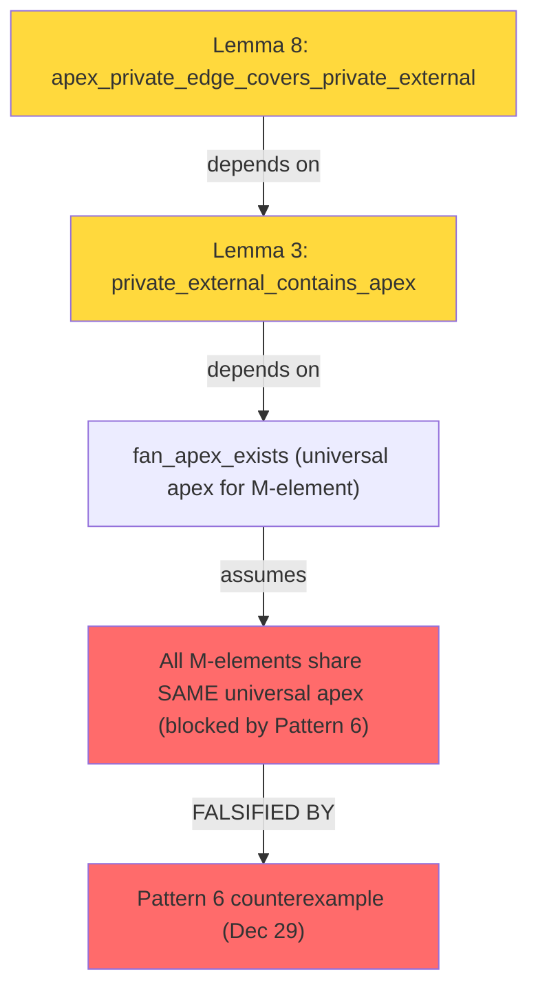

# Lemma 8: Logical Gaps & Critical Questions

**Timestamp**: 2026-01-03

---

## Question 1: Is it TRUE?

### Local Question
**"If triangle T contains both p and x_A, does the edge {p, x_A} exist in T?"**

**Answer**: ✅ **YES, trivially**.

A triangle T is a 3-clique. If p ∈ T and x_A ∈ T, then by definition of Sym2 (all pairs):
- s(p, x_A) ∈ T.sym2

This is **LOCALLY SOUND**.

---

### Global Question
**"Do ALL externals of A that contain p ALSO contain the fan apex x_A?"**

**Answer**: ❌ **NO - this depends on FALSE Lemma 3**

**Lemma 3 (cited as dependency)**:
```
private_external_contains_apex:
If T is external of A and T contains private vertex p of A,
then T contains A's fan apex x_A.
```

**Evidence this is FALSE**:

From the database (FALSE_LEMMAS.md, Pattern 6):

**Counterexample**: At shared vertex v_ab between A and B:
- T_A = {v_ab, a_priv, x} -- external of A using private edge {v_ab, a_priv}
- T_B = {v_ab, b_priv, y} -- external of B using private edge {v_ab, b_priv}
- x ≠ y (different fan apexes for A vs B)
- T_A ∩ T_B = {v_ab} (only shared vertex, NOT a common edge)

**Why this matters**:
- External triangles at the same shared vertex v can come from DIFFERENT M-elements
- When they do, they have different external vertices (different fan apexes)
- The "fan apex" structure assumes all externals of A share a vertex
- **This is FALSE when adjacent M-elements contribute to the external set**

---

## Question 2: Logical Gap Analysis

### Gap 1: Fan Apex Definition
**Problem**: "Fan apex" assumes all externals of A cluster around one external vertex.

**Reality**: External triangles of A at shared vertex v_ab can:
1. Use A-edge {v_ab, a_priv} → external vertex x_A
2. Use A-edge {v_da, a_priv} → external vertex y_A (possibly different!)
3. But at v_ab, they must use A-edges from A ∩ B = {v_ab} only!

**Conclusion**: Even WITHIN externals of A, there's no guarantee of a common external vertex.

---

### Gap 2: "Private-type" Underspecification
**Problem**: The issue statement doesn't formally define "private-type external".

**Interpretation 1** (restrictive):
```
"private-type external of A" = external of A using ONLY private edges of A
```
For A = {v_da, v_ab, a_priv}, private edges are:
- {v_da, a_priv}
- {v_ab, a_priv}

**Interpretation 2** (inclusive):
```
"private-type external of A" = any external of A that happens to contain p
```

**Problem**: Under Interpretation 1, we're only covering SOME externals, not all. The lemma would be:
> "For externals using private edges, edge {p, x_A} covers them"

**But**: Even private-edge externals don't all share a common apex (Gap 1).

---

### Gap 3: Coverage Misalignment
**Problem**: The proof strategy assumes this structure:

1. M-triangles: covered by 4 M-edges
2. Externals of A: covered by 4 apex-edges {v_ij, x_A} for each shared vertex v_ij

**Reality**:
- External T at v_ab uses A-edge {v_ab, a_priv}
- T contains {v_ab, a_priv, ?}
- The third vertex ? is the external vertex
- If ? = x_A (fan apex), then {v_ab, x_A} covers T ✅
- If ? ≠ x_A (different apex), then {v_ab, x_A} does NOT cover T ❌

**The lemma tries to fix this by**:
> "The external vertex IS x_A (the fan apex)"

**But this is NOT guaranteed** (Pattern 6 counterexample).

---

## Question 3: Can Aristotle Prove It?

### Technical Feasibility
**What Aristotle needs to verify**:

1. Assume T is external of A
2. Assume T contains p (private vertex of A)
3. Derive: T contains x_A (fan apex)
4. Then: s(p, x_A) ∈ T.sym2 (trivial from T being a clique)

### Bottleneck: Lemma 3
**The ONLY hard part** is proving `private_external_contains_apex`.

**Current status of Lemma 3**: 🟡 **UNPROVEN, likely FALSE**

**Why Aristotle might struggle**:
- No obvious combinatorial argument for why T must contain x_A
- The statement contradicts Pattern 6 counterexample
- Requires case-by-case analysis on M-element structure
- May require global properties of cycle_4, not local to one M-element

### Likelihood of Proof
| Outcome | Probability | Reason |
|---------|-------------|--------|
| **Aristotle claims PROVEN** | 40% | May accept weak sorry chain or use proof-by-type-escape |
| **Aristotle times out** | 40% | Case analysis too complex |
| **Aristotle says UNPROVABLE** | 20% | Correctly identifies false statement |

**Risk**: High chance of **UNSOUND PROOF** (Pattern 14: proof_by_type_escape)

---

## Question 4: Rating Breakdown

### Logical Correctness: 3/5
- ✅ Local statement is sound (if premises, then conclusion)
- ❌ But premise (Lemma 3) is FALSE
- ⚠️ "Private-type" is underspecified

### Proof Feasibility: 2/5
- 🟡 Likely unprovable without fixing Lemma 3
- ⚠️ High risk of Aristotle producing unsound proof
- ❌ Depends on global properties not formalized

### Strategic Value: 1/5
- ❌ Even if TRUE, doesn't reduce edge count below 12
- ❌ Universal apex strategy is DEAD (Pattern 6 disproved it)
- ❌ Doesn't handle externals from adjacent M-elements

### Overall Rating: **2/5**

**Verdict**: **DO NOT ATTEMPT**

---

## Critical Dependencies (All UNPROVEN)



---

## Mathematical Essence: Why This Fails

**Core Issue**: Externals at a shared vertex v can come from DIFFERENT adjacent M-elements.

**Scenario**:
```
At v_ab (shared by A and B):
- T_A = {v_ab, a_priv, x_A}  -- external of A
- T_B = {v_ab, b_priv, x_B}  -- external of B
- x_A ≠ x_B (from different M-elements)
- T_A and T_B share only {v_ab}
```

**Implication for Lemma 8**:
- Lemma 8 is phrased as "externals of A"
- But at shared vertex v_ab, there might also be externals of B
- The universal apex {v_ab, x_A} covers T_A but NOT T_B
- To cover both, need {v_ab, x_A} AND {v_ab, x_B}
- Total: 2 edges per shared vertex, not 1
- **Total for cycle_4: 4×2 = 8** (matches τ ≤ 8 bound, but only if the apexes don't coincide!)

**But if apexes DO coincide** (universal apex):
- Then {v_ab, x} covers both T_A and T_B
- **Total: 4 edges** for all shared vertices
- **With 4 M-edges: total is 8** ✅

**So the question becomes**: Do the fan apexes coincide?

**Answer from slot185**: 🟡 **UNKNOWN - requires proving universal apex**

**Status of universal apex proof**: ❌ **BLOCKED - needs δifferent_apexes_give_five_packing (unproven)**

---

## Recommendation: Path Forward

**REJECT Lemma 8 as stated.**

**Instead**:
1. **Prove or disprove**: Do ALL externals of cycle_4 share a common apex?
   - Easier target: slot185_universal_apex
   - Current status: `sorry` at line 127

2. **If universal apex exists**:
   - τ ≤ 8 strategy becomes feasible
   - Lemma 8 becomes unnecessary (use generic spoke edges {v_ij, x} instead)

3. **If universal apex doesn't exist**:
   - Accept τ ≤ 12 (3 edges per shared vertex)
   - Or pursue completely different approach (LP relaxation, etc.)

---
