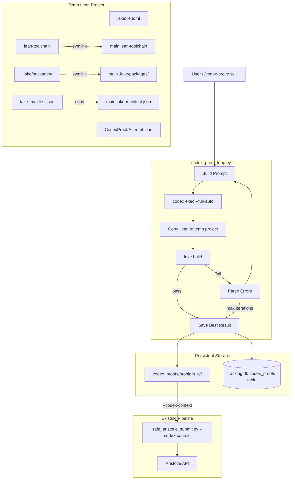
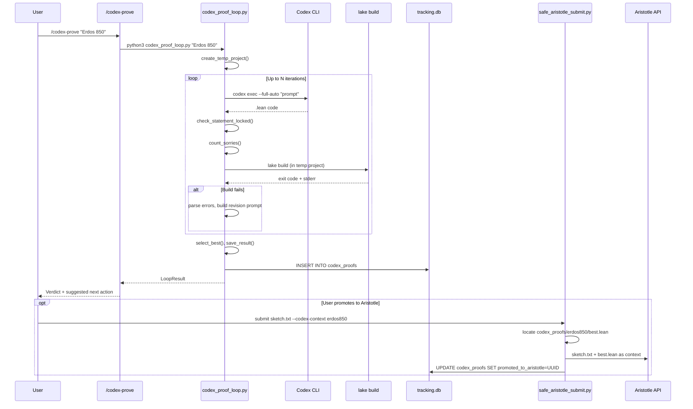

# Design: Codex Proof Loop

## Overview

A single Python script (`scripts/codex_proof_loop.py`) orchestrates a compile-fix loop: Codex generates Lean 4 proofs via `codex exec --full-auto`, then `lake build` runs outside the sandbox, errors feed back to Codex, repeat up to N iterations. Results land in `codex_proofs/<problem_id>/` and a new `codex_proofs` DB table. A `/codex-prove` skill wraps the script for conversational use. Compiled proofs flow to Aristotle as `--context` files via the existing `safe_aristotle_submit.py`.

## Architecture



## Components

### 1. Core Script: `scripts/codex_proof_loop.py`

**Handles**: Full compile-fix loop orchestration, sorry tracking, theorem statement locking, temp project management, DB writes.

**CLI Interface**:
```
python3 scripts/codex_proof_loop.py <problem_description_or_file> \
    [--context file.lean ...] \
    [--max-iterations N] \          # default 5
    [--build-timeout N] \           # default 300s
    [--reasoning-effort LEVEL] \    # low/medium/high/xhigh, default high
    [--keep-temp] \                 # retain temp dir for debugging
    [--problem-id ID]               # explicit ID (else auto-extracted)
```

**Interfaces**:

```python
@dataclass
class LoopConfig:
    problem: str                    # problem description text or path
    context_files: list[Path]       # optional .lean context
    max_iterations: int = 5
    build_timeout: int = 300        # seconds per lake build
    reasoning_effort: str = "high"
    keep_temp: bool = False
    problem_id: str | None = None

@dataclass
class IterationResult:
    iteration: int
    lean_code: str
    build_success: bool
    build_errors: str               # raw stderr
    sorry_count: int
    wall_time: float                # seconds for this iteration

@dataclass
class LoopResult:
    problem_id: str
    iterations: list[IterationResult]
    best: IterationResult           # fewest sorries, prefers compiled
    compiled: bool
    total_wall_time: float
    lean_file: Path                 # saved best .lean
    build_log: Path                 # saved build log
    sorry_targets: list[Path]       # extracted sorry sub-problems
```

**Internal Functions**:

| Function | Purpose |
|----------|---------|
| `run_loop(config) -> LoopResult` | Main entry point, orchestrates iterations |
| `build_initial_prompt(problem, context_files) -> str` | First-iteration Codex prompt |
| `build_revision_prompt(problem, prior_code, errors, iteration) -> str` | Error-feedback prompt |
| `invoke_codex(prompt, reasoning_effort) -> str` | Runs `codex exec`, returns stdout |
| `create_temp_project(base_dir) -> Path` | Creates isolated Lean project with symlinks |
| `run_lake_build(project_dir, timeout) -> tuple[bool, str]` | Runs `lake build`, returns (success, stderr) |
| `count_sorries(lean_code) -> int` | Counts non-comment `sorry` occurrences |
| `extract_theorem_statement(lean_code) -> str` | Extracts theorem statement for locking |
| `check_statement_locked(original, revised) -> bool` | Validates theorem statement unchanged |
| `select_best(iterations) -> IterationResult` | Picks best: compiled > fewer sorries |
| `extract_sorry_targets(lean_code, problem_id) -> list[Path]` | Extracts each sorry as sub-problem |
| `save_result(result, problem_id) -> Path` | Writes to `codex_proofs/` and DB |

### 2. Temp Lean Project Factory

**Handles**: Creating isolated build environments that share the Mathlib cache.

**Structure per temp project**:
```
/tmp/codex_proof_XXXXXX/
  lakefile.toml           # Generated: targets CodexProof lib
  lean-toolchain          # Symlink -> /Users/.../math/lean-toolchain
  lake-manifest.json      # Copy from main project (exact dep pins)
  .lake/
    packages/             # Symlink -> /Users/.../math/.lake/packages/
  CodexProof/
    Attempt.lean          # Codex-generated file
```

**Why this structure**:
- Symlinked `.lake/packages/` avoids 30+ min Mathlib rebuild
- Separate lib name (`CodexProof`) prevents conflicts with main `Math` lib
- Copied `lake-manifest.json` ensures identical dependency versions
- Temp dir isolation means parallel loops can't interfere
- `lake build` only compiles the single `Attempt.lean` file (~seconds)

**Generated `lakefile.toml`**:
```toml
name = "codex-proof"
version = "0.1.0"
defaultTargets = ["CodexProof"]

[[require]]
name = "mathlib"
scope = "leanprover-community"
rev = "f897ebcf72cd16f89ab4577d0c826cd14afaafc7"

[[lean_lib]]
name = "CodexProof"
```

### 3. Codex Invocation

**Pattern**: Write prompt to temp file, run `codex exec --full-auto`, capture stdout. Same pattern as `debate.py:call_codex()` but with `workspace-write` sandbox (default for `--full-auto`) and optional reasoning effort config.

```python
def invoke_codex(prompt: str, reasoning_effort: str = "high") -> str:
    with tempfile.NamedTemporaryFile(mode="w", suffix=".txt", delete=False) as f:
        f.write(prompt)
        prompt_file = f.name

    cmd = ["codex", "exec", "--full-auto"]
    if reasoning_effort != "medium":  # medium is default
        cmd.extend(["-c", f'model_reasoning_effort="{reasoning_effort}"'])
    cmd.append(f"$(cat '{prompt_file}')")

    result = subprocess.run(
        ["bash", "-c", " ".join(cmd)],
        capture_output=True, text=True, timeout=180
    )
    # ... extract .lean code from output ...
```

**Prompt Templates**:

Initial prompt (iteration 1):
```
Write a Lean 4 proof for the following problem. Output ONLY valid Lean 4 code.

PROBLEM:
{problem_description}

{context_section if context_files}

RULES:
- Import Mathlib at the top: `import Mathlib`
- Use `sorry` for sub-goals you cannot prove, but minimize sorry count
- Do NOT change the theorem statement if one is provided
- Target Lean 4 v4.24.0 with Mathlib v4.24.0
- Output a single complete .lean file, nothing else
```

Revision prompt (iteration 2+):
```
Your Lean 4 proof failed to compile. Fix the errors below.

ORIGINAL PROBLEM:
{problem_description}

YOUR PREVIOUS CODE:
```lean
{prior_code}
```

COMPILER ERRORS:
{build_errors}

RULES:
- Fix the compilation errors
- Do NOT change the theorem statement: `{locked_statement}`
- Do NOT add new `sorry` unless absolutely necessary
- Minimize total sorry count (current: {sorry_count})
- Output the complete corrected .lean file, nothing else
```

### 4. Result Storage: `codex_proofs/`

```
codex_proofs/
  erdos850/
    attempt_001/
      proof.lean              # The Lean code
      metadata.json           # Structured metadata
      build.log               # Full build output
    attempt_002/
      ...
    best.lean                 # Symlink -> best attempt's proof.lean
    sorry_targets/            # Extracted sorry sub-problems (if any)
      sorry_1.lean
      sorry_2.lean
      sorry_1.txt             # Informal sketch version for Aristotle
```

**metadata.json**:
```json
{
  "problem_id": "erdos850",
  "attempt": 1,
  "timestamp": "2026-03-14T10:30:00Z",
  "iterations": 3,
  "sorry_count": 1,
  "compiled": true,
  "model": "gpt-5.3-codex",
  "reasoning_effort": "high",
  "wall_time_seconds": 145.2,
  "theorem_statement": "theorem erdos850 ...",
  "context_files": ["submissions/nu4_final/slot700_result.lean"]
}
```

### 5. DB Schema: `codex_proofs` Table

```sql
CREATE TABLE codex_proofs (
    id INTEGER PRIMARY KEY AUTOINCREMENT,
    problem_id TEXT NOT NULL,
    created_at TEXT DEFAULT CURRENT_TIMESTAMP,

    -- Loop results
    iterations INTEGER NOT NULL,
    sorry_count INTEGER,
    compiled INTEGER NOT NULL DEFAULT 0,    -- boolean

    -- Model config
    model TEXT DEFAULT 'gpt-5.3-codex',
    reasoning_effort TEXT DEFAULT 'high',
    wall_time_seconds REAL,

    -- File paths (relative to MATH_DIR)
    lean_file TEXT,                          -- best .lean path
    build_log TEXT,                          -- build log path

    -- Aristotle bridging
    promoted_to_aristotle TEXT,             -- submission UUID if promoted

    -- Sorry decomposition
    parent_proof_id INTEGER,                -- FK to self for sorry-targeted sub-proofs

    -- Metadata
    theorem_statement TEXT,                 -- locked statement for verification
    context_files TEXT,                     -- JSON array of context file paths

    FOREIGN KEY (parent_proof_id) REFERENCES codex_proofs(id)
);

CREATE INDEX idx_codex_proofs_problem ON codex_proofs(problem_id);
CREATE INDEX idx_codex_proofs_compiled ON codex_proofs(compiled);
CREATE INDEX idx_codex_proofs_parent ON codex_proofs(parent_proof_id);
```

**Migration**: Inline SQL in `codex_proof_loop.py` -- runs `CREATE TABLE IF NOT EXISTS` on first use. No separate migration script needed (pattern matches how `init_tracking_db.py` works).

### 6. Context Bridging: `--codex-context` Flag

Extend `safe_aristotle_submit.py` CLI argument parsing:

```python
# In CLI arg parsing section (line ~563):
elif arg == '--codex-context' and i + 1 < len(all_args):
    # Auto-locate best Codex proof for this problem
    problem_id = all_args[i + 1]
    best_path = MATH_DIR / "codex_proofs" / problem_id / "best.lean"
    if best_path.exists():
        context_files.append(best_path.resolve())
    else:
        print(f"WARNING: No Codex best proof found for '{problem_id}'")
    i += 2
```

No changes to `safe_submit()`, `check_gap_targeting()`, or `gather_context()`. The `--codex-context` flag simply adds a file to `context_files[]` which already flows through to the tar.gz bundle.

### 7. Sorry Extraction

```python
def extract_sorry_targets(lean_code: str, problem_id: str) -> list[dict]:
    """Extract each sorry with surrounding theorem/lemma context.

    Returns list of:
      {"name": "subgoal_1", "lean": "...", "informal": "...", "line": N}
    """
```

Strategy:
1. Parse the .lean file line-by-line
2. Track current theorem/lemma scope (name + signature)
3. When `sorry` found (not in comment), extract:
   - The enclosing theorem/lemma declaration
   - All lines from declaration start to `sorry`
   - Type signature (the goal to prove)
4. Generate standalone `.lean` file: imports + theorem statement + `sorry`
5. Generate `.txt` informal sketch for Aristotle submission

This is a text-based extraction, not a full Lean parser. It handles the common patterns:
- `theorem name : Type := by ... sorry`
- `lemma name : Type := by ... sorry`
- Nested `have` blocks with sorry

### 8. `/codex-prove` Skill

File: `.claude/commands/codex-prove.md`

```markdown
---
description: Run a Codex proof loop — Codex writes Lean 4, iterates against lake build
allowed-tools: Read, Grep, Glob, Bash, Write
argument-hint: <problem description or .txt file> [--context file.lean] [--max-iterations N]
---
```

The skill:
1. Parses `$ARGUMENTS` for problem description and flags
2. Runs `python3 scripts/codex_proof_loop.py $ARGUMENTS`
3. Reports per-iteration progress (iteration #, build status, sorry count)
4. On completion, displays verdict table and suggests next action
5. If compiled with 0 sorries: suggests `/audit <path>`
6. If compiled with sorries: suggests `/codex-prove --sorry-target <path>` or `/submit <sketch> --codex-context <problem_id>`

## Data Flow



## Technical Decisions

| Decision | Options Considered | Choice | Rationale |
|----------|-------------------|--------|-----------|
| Codex invocation | A) Codex writes + builds inside sandbox B) Codex writes only, build outside | B | Lake needs system access; sandbox blocks it. Script has full control over build loop. |
| Build isolation | A) Write to main `Math/` B) New lean_lib in main project C) Temp directory per attempt | C | No main project pollution. Parallel safety. Auto-cleanup. |
| Mathlib cache | A) Full copy B) Symlink `.lake/packages/` C) Symlink entire `.lake/` | B | Symlink packages avoids 30min rebuild. Symlink whole `.lake/` would share lakefile.olean (wrong lib name). |
| DB schema | A) Extend `submissions` table B) New `codex_proofs` table | B | Clean separation. Codex iterations != Aristotle submissions. Different lifecycle. |
| Sorry tracking | A) Count in final only B) Track per-iteration, reject inflation | B | Prevents Codex from "fixing" errors by adding sorry. Keeps best attempt. |
| Statement locking | A) Trust Codex not to change it B) Extract + validate each iteration | B | Critical safety: without locking, Codex can trivialize theorems. |
| Result selection | A) Last iteration B) First compile C) Min sorries, prefer compiled | C | Best result may not be last. First compile may have more sorries than later attempt. |
| Prompt delivery | A) CLI argument B) Temp file + `$(cat)` C) Stdin pipe | B | Matches existing `debate.py` pattern. Handles long prompts. |
| Migration | A) Separate SQL file B) Inline CREATE IF NOT EXISTS | B | One-file simplicity. No migration tooling in project. |
| `mk` extension | A) New subcommands in `mk` script B) Separate CLI | A | Follows existing pattern. `mk codex` / `mk codex-best` fit naturally. |

## File Structure

| File | Action | Purpose |
|------|--------|---------|
| `scripts/codex_proof_loop.py` | Create | Core compile-fix loop script (~350 lines) |
| `.claude/commands/codex-prove.md` | Create | `/codex-prove` skill definition |
| `codex_proofs/` | Create (dir) | Result storage root (gitignored) |
| `scripts/safe_aristotle_submit.py` | Modify | Add `--codex-context <problem_id>` flag (~10 lines) |
| `math-forge/scripts/mk` | Modify | Add `codex` and `codex-best` subcommands (~40 lines) |
| `.gitignore` | Modify | Add `codex_proofs/` entry |

## Error Handling

| Error Scenario | Handling Strategy | User Impact |
|----------------|-------------------|-------------|
| Codex CLI not found | Check `which codex` at startup, exit with install instructions | Clear error message |
| Codex returns empty/garbage | Skip iteration, log warning, continue loop | Lost iteration, retries |
| Codex changes theorem statement | Reject iteration, reuse prior code with error feedback | Iteration not wasted (prior code preserved) |
| `lake build` timeout | Kill process after `build_timeout`, count as failed build | Iteration fails, loop continues |
| `lake build` crash (e.g., missing .lake) | Abort loop entirely, save partial results | Partial result saved, clear error |
| Sorry count increases | Reject iteration, keep prior best, note in revision prompt | Codex told "don't add sorries" |
| Temp dir creation fails | Abort with error | OS-level issue |
| DB write fails | Log warning, continue (results saved to files) | Files still saved |
| SIGINT during loop | Signal handler saves current best, cleans temp dir | Graceful shutdown |
| All iterations fail to compile | Save best attempt (fewest sorries), mark `compiled=0` | User gets partial result |
| Network error during `codex exec` | Retry once, then skip iteration | Brief interruption tolerated |

## Edge Cases

- **Empty Codex output**: Skip iteration, decrement remaining iterations, log warning
- **Codex outputs markdown instead of Lean**: Extract code from ````lean` fences if present; else skip
- **Multiple theorem statements in output**: Lock the FIRST theorem statement; allow helper lemmas
- **Sorry in comments**: `count_sorries()` uses regex `(?<!--)(?<!//)\\bsorry\\b` to exclude commented sorries
- **Zero-sorry on first iteration**: Short-circuit -- save immediately, skip remaining iterations
- **Parallel runs same problem**: Each run gets unique attempt dir (`attempt_001`, `attempt_002`, etc.) based on existing dirs. DB rows are independent.
- **Main `.lake/` not present**: Abort with message "Run `lake build` in main project first to populate .lake/packages/"
- **Problem ID collision**: `codex_proofs/<id>/` dirs are append-only; attempt numbering auto-increments

## Test Strategy

### Unit Tests (not in project currently, but script should be testable)

- `count_sorries()`: Various Lean code snippets -- commented sorries, string sorries, nested
- `extract_theorem_statement()`: Single theorem, multiple lemmas + theorem, no theorem
- `check_statement_locked()`: Exact match, whitespace differences (tolerate), actual changes (reject)
- `select_best()`: Various iteration result lists -- all fail, one compiles, multiple compile with different sorry counts
- `extract_sorry_targets()`: 0 sorries (empty list), 1 sorry, multiple sorries in different scopes

### Integration Tests (manual, against real Codex + Lake)

- End-to-end: trivial problem (e.g., "prove 1+1=2 in Lean 4") -> should compile in 1 iteration
- Error feedback: intentionally broken Lean -> verify errors parsed and sent back
- Temp project: verify symlinks resolve, `lake build` runs, temp dir cleaned
- DB write: verify row created in `codex_proofs` table
- Context bridging: verify `--codex-context` adds file to submission tar.gz

### Smoke Test Command

```bash
python3 scripts/codex_proof_loop.py "Prove that 1 + 1 = 2 in Lean 4" --max-iterations 2
```

Expected: Compiles on iteration 1, 0 sorries, result in `codex_proofs/prove_1_1_2/`.

## Performance Considerations

- **Build time**: With symlinked `.lake/packages/`, incremental build of single .lean file is ~5-15s. Total loop (5 iterations) should be < 5 min.
- **Codex latency**: `codex exec` typically 30-120s per call depending on reasoning effort. With `xhigh`, could be 2-3 min.
- **Disk**: Each attempt ~50KB (one .lean + logs + metadata). Thousands of attempts = tens of MB. Negligible.
- **Temp dir cleanup**: Default behavior deletes temp dir after each run. `--keep-temp` for debugging.
- **Parallelism**: Independent temp dirs + independent DB rows. No shared mutable state between parallel runs.

## Security Considerations

- **Codex sandbox**: `--full-auto` (workspace-write) limits file writes to working dir. Proof loop creates its own temp dir as working dir.
- **No API keys in prompts**: Problem descriptions only. No secrets passed to Codex.
- **lake build runs unsandboxed**: Necessary for compilation. Lake is trusted tooling.
- **SQL injection**: All DB writes use parameterized queries (not string interpolation).
- **Codex output as code**: Generated .lean files are only compiled by Lake, never executed as general-purpose code.

## Existing Patterns to Follow

Based on codebase analysis:

1. **Script structure**: Match `safe_aristotle_submit.py` pattern -- module-level constants, dataclasses, async where needed, CLI with argparse at bottom
2. **Codex invocation**: Match `debate.py:call_codex()` pattern -- temp file for prompt, `bash -c` wrapper, capture stdout/stderr
3. **DB access**: Match `safe_aristotle_submit.py:gather_context()` pattern -- `sqlite3.connect()`, PRAGMA table_info for safety, parameterized queries
4. **Error reporting**: Match existing emoji-prefixed logging (`print("...")` with status indicators)
5. **Path resolution**: Match `MATH_DIR = Path(__file__).resolve().parent.parent` pattern
6. **Skill files**: Match `.claude/commands/submit.md` structure -- YAML frontmatter with description/allowed-tools/argument-hint, numbered steps
7. **`mk` CLI extension**: Match existing `case` statement pattern in `mk` script -- new case blocks for `codex` and `codex-best`

## Implementation Steps

1. **Create `scripts/codex_proof_loop.py`** (FR-1, FR-2, FR-3, FR-4, FR-11, FR-12, FR-13)
   - Core loop: `run_loop()`, `invoke_codex()`, `run_lake_build()`
   - Temp project: `create_temp_project()` with symlinks
   - Sorry counting + statement locking
   - Result selection: `select_best()`
   - Signal handler for SIGINT
   - CLI with argparse

2. **Create `codex_proofs/` directory + DB migration** (FR-5, FR-6)
   - `mkdir -p codex_proofs`
   - Inline `CREATE TABLE IF NOT EXISTS codex_proofs` in script
   - `save_result()` writes files + DB row

3. **Create `.claude/commands/codex-prove.md`** (FR-7)
   - Skill wrapping the script
   - Progress reporting instructions
   - Suggested next actions

4. **Extend `safe_aristotle_submit.py` with `--codex-context`** (FR-8)
   - Add arg parsing for `--codex-context <problem_id>`
   - Resolve `codex_proofs/<problem_id>/best.lean`
   - Append to `context_files[]`
   - Update `promoted_to_aristotle` in DB after successful submit

5. **Implement sorry extraction** (FR-9)
   - `extract_sorry_targets()` in core script
   - Generate standalone `.lean` sub-problem files
   - Generate `.txt` informal sketches from sorry context
   - Track parent-child in DB via `parent_proof_id`

6. **Extend `mk` CLI** (FR-10)
   - `mk codex <problem_id>` -- query codex_proofs table
   - `mk codex-best <problem_id>` -- return best.lean path
   - Add to help text

7. **Update `.gitignore`**
   - Add `codex_proofs/` line

8. **Smoke test end-to-end**
   - Trivial problem -> verify full flow
   - Error-feedback problem -> verify loop iterates
   - Context bridging -> verify Aristotle gets the context
