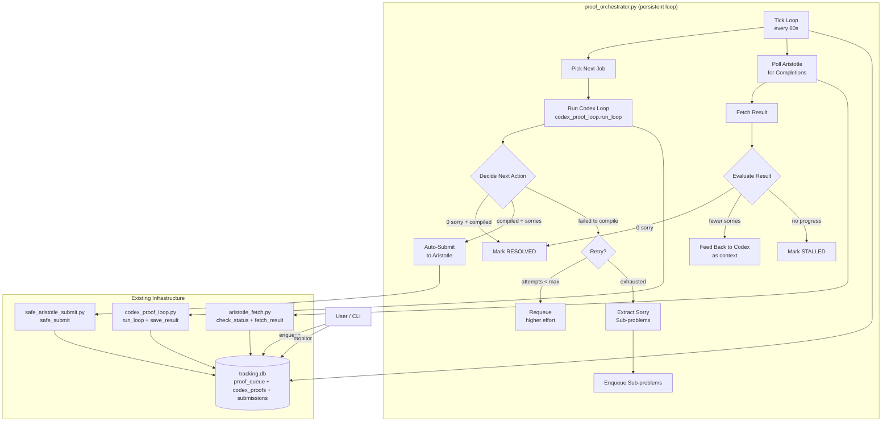
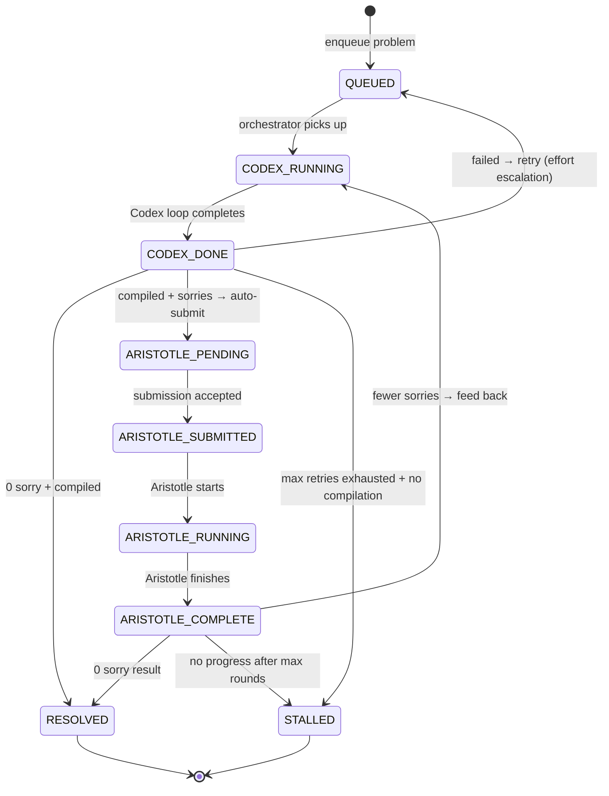
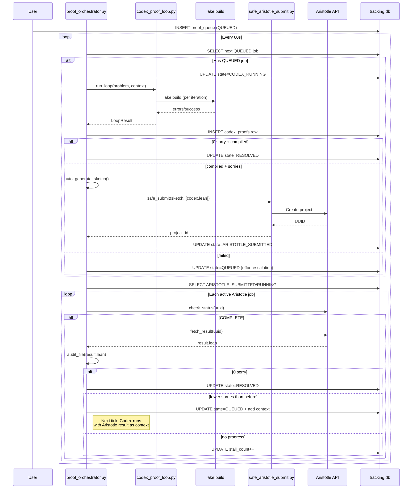

# Design: Proof Orchestration Queue

## Overview

A single persistent Python script (`scripts/proof_orchestrator.py`) manages a `proof_queue` DB table as a state machine. It loops: run Codex on queued problems, auto-submit compiled-with-sorries to Aristotle, poll Aristotle for results, feed results back to Codex, repeat. All state lives in `submissions/tracking.db` -- crash-safe, resumable. Runs as a background process via `nohup` or `/loop` skill.

## Architecture



## State Machine



### State Definitions

| State | Meaning | Who Transitions |
|-------|---------|----------------|
| `QUEUED` | Waiting for Codex | Orchestrator picks next |
| `CODEX_RUNNING` | Codex loop in progress | Orchestrator (sync) |
| `CODEX_DONE` | Codex finished, decision pending | Orchestrator (immediate) |
| `ARISTOTLE_PENDING` | Sketch generated, awaiting submit | Orchestrator submits |
| `ARISTOTLE_SUBMITTED` | Submitted to Aristotle | Orchestrator polls |
| `ARISTOTLE_RUNNING` | Aristotle confirmed working | Orchestrator polls |
| `ARISTOTLE_COMPLETE` | Aristotle result fetched | Orchestrator evaluates |
| `RESOLVED` | 0 sorry, compiled clean | Terminal |
| `STALLED` | No more progress possible | Terminal |

## Components

### 1. DB Schema: `proof_queue` Table

```sql
CREATE TABLE IF NOT EXISTS proof_queue (
    id INTEGER PRIMARY KEY AUTOINCREMENT,
    problem_id TEXT NOT NULL,
    problem_source TEXT NOT NULL,           -- file path or inline text
    created_at TEXT DEFAULT CURRENT_TIMESTAMP,
    updated_at TEXT DEFAULT CURRENT_TIMESTAMP,

    -- State machine
    state TEXT NOT NULL DEFAULT 'QUEUED',
    priority INTEGER NOT NULL DEFAULT 5,    -- 1=highest, 10=lowest

    -- Codex tracking
    codex_proof_id INTEGER,                 -- FK to codex_proofs.id (current best)
    codex_attempts INTEGER DEFAULT 0,
    codex_best_sorry INTEGER,               -- best sorry count from Codex
    codex_compiled INTEGER DEFAULT 0,       -- did Codex ever compile?
    reasoning_effort TEXT DEFAULT 'high',   -- current effort level

    -- Aristotle tracking
    aristotle_uuid TEXT,                    -- current Aristotle job UUID
    aristotle_slot INTEGER,                 -- slot number
    aristotle_rounds INTEGER DEFAULT 0,     -- how many Aristotle round-trips

    -- Context stacking
    context_files TEXT,                     -- JSON array of context file paths
    parent_queue_id INTEGER,               -- FK to self for sub-problems

    -- Progress tracking
    total_rounds INTEGER DEFAULT 0,         -- codex + aristotle round-trips
    best_sorry_count INTEGER,               -- global best across all rounds
    last_sorry_count INTEGER,               -- previous round's sorry count
    stall_count INTEGER DEFAULT 0,          -- consecutive rounds with no progress

    -- Limits
    max_codex_attempts INTEGER DEFAULT 3,
    max_aristotle_rounds INTEGER DEFAULT 3,
    max_total_rounds INTEGER DEFAULT 8,
    max_stall INTEGER DEFAULT 2,            -- stall N times → STALLED

    -- Result
    resolved_at TEXT,
    resolved_proof TEXT,                    -- path to final 0-sorry .lean
    error_message TEXT,

    FOREIGN KEY (codex_proof_id) REFERENCES codex_proofs(id),
    FOREIGN KEY (parent_queue_id) REFERENCES proof_queue(id)
);

CREATE INDEX IF NOT EXISTS idx_pq_state ON proof_queue(state);
CREATE INDEX IF NOT EXISTS idx_pq_priority ON proof_queue(priority, created_at);
CREATE INDEX IF NOT EXISTS idx_pq_problem ON proof_queue(problem_id);
```

### 2. Orchestrator Core: `scripts/proof_orchestrator.py`

**Handles**: Main loop, state transitions, decision logic, Aristotle polling.

**Interfaces**:

```python
@dataclass
class OrchestratorConfig:
    poll_interval: int = 60          # seconds between ticks
    max_concurrent_aristotle: int = 5
    codex_timeout: int = 600         # max seconds per Codex loop
    aristotle_poll_interval: int = 300  # seconds between Aristotle polls
    dry_run: bool = False            # log decisions but don't execute
    single_pass: bool = False        # run one tick and exit (for testing)

class ProofOrchestrator:
    def __init__(self, config: OrchestratorConfig):
        self.config = config
        self.db_path = TRACKING_DB
        self.running = True

    def run(self):
        """Main loop. Runs until SIGINT/SIGTERM."""
        while self.running:
            self.tick()
            time.sleep(self.config.poll_interval)

    def tick(self):
        """One orchestration cycle."""
        self.poll_aristotle_jobs()     # Check all ARISTOTLE_SUBMITTED/RUNNING
        self.process_completions()     # Evaluate ARISTOTLE_COMPLETE results
        self.run_next_codex_job()      # Pick highest-priority QUEUED, run Codex

    def run_next_codex_job(self):
        """Pick one QUEUED job, run Codex, update state."""

    def poll_aristotle_jobs(self):
        """Check status of all ARISTOTLE_SUBMITTED/RUNNING jobs."""

    def process_completions(self):
        """Evaluate ARISTOTLE_COMPLETE results, decide next action."""

    def decide_after_codex(self, queue_id: int, result: LoopResult):
        """State transition after Codex finishes."""

    def decide_after_aristotle(self, queue_id: int, audit: dict):
        """State transition after Aristotle result fetched."""

    def auto_generate_sketch(self, queue_id: int, lean_path: Path) -> Path:
        """Generate bare-gap sketch from Codex .lean for Aristotle submission."""

    def submit_to_aristotle(self, queue_id: int, sketch_path: Path, context: list[Path]):
        """Submit sketch + context to Aristotle, update queue state."""

    def enqueue_sub_problems(self, queue_id: int, sorry_targets: list[Path]):
        """Extract sorry targets and enqueue as child problems."""
```

### 3. Decision Logic

#### After Codex (`decide_after_codex`)

```python
def decide_after_codex(self, queue_id: int, result: LoopResult):
    row = self.get_queue_row(queue_id)

    if result.compiled and result.best.sorry_count == 0:
        # PERFECT: resolved
        self.transition(queue_id, 'RESOLVED', resolved_proof=str(result.lean_file))
        return

    if result.compiled and result.best.sorry_count > 0:
        # Compiled with sorries → auto-submit to Aristotle
        sketch = self.auto_generate_sketch(queue_id, result.lean_file)
        context = [result.lean_file]  # Codex .lean as context for Aristotle
        self.transition(queue_id, 'ARISTOTLE_PENDING')
        self.submit_to_aristotle(queue_id, sketch, context)
        return

    # Failed to compile
    if row['codex_attempts'] < row['max_codex_attempts']:
        # Retry with escalated reasoning effort
        next_effort = self.escalate_effort(row['reasoning_effort'])
        self.transition(queue_id, 'QUEUED',
                       reasoning_effort=next_effort,
                       codex_attempts=row['codex_attempts'] + 1)
        return

    # Max Codex attempts exhausted
    if result.best and result.best.sorry_count > 0:
        # Has partial result → extract sorry targets as sub-problems
        self.enqueue_sub_problems(queue_id, result.sorry_targets)
        self.transition(queue_id, 'STALLED',
                       error_message='Max Codex attempts, decomposed to sub-problems')
    else:
        self.transition(queue_id, 'STALLED',
                       error_message='Max Codex attempts, no compilable output')
```

#### After Aristotle (`decide_after_aristotle`)

```python
def decide_after_aristotle(self, queue_id: int, audit: dict, result_path: Path):
    row = self.get_queue_row(queue_id)

    if audit['sorry'] == 0 and audit['verdict'] == 'compiled_clean':
        # RESOLVED
        self.transition(queue_id, 'RESOLVED', resolved_proof=str(result_path))
        return

    prev_sorry = row['last_sorry_count'] or row['codex_best_sorry'] or float('inf')

    if audit['sorry'] < prev_sorry:
        # Progress! Feed result back to Codex as context
        context = json.loads(row['context_files'] or '[]')
        context.append(str(result_path))
        self.transition(queue_id, 'QUEUED',
                       context_files=json.dumps(context),
                       last_sorry_count=audit['sorry'],
                       stall_count=0,
                       total_rounds=row['total_rounds'] + 1)
        return

    # No progress
    new_stall = row['stall_count'] + 1
    if new_stall >= row['max_stall']:
        self.transition(queue_id, 'STALLED',
                       error_message=f'No progress after {row["aristotle_rounds"]} Aristotle rounds')
    elif row['total_rounds'] < row['max_total_rounds']:
        # Try again with Aristotle result as added context anyway
        context = json.loads(row['context_files'] or '[]')
        context.append(str(result_path))
        self.transition(queue_id, 'QUEUED',
                       context_files=json.dumps(context),
                       stall_count=new_stall,
                       total_rounds=row['total_rounds'] + 1)
    else:
        self.transition(queue_id, 'STALLED',
                       error_message='Max total rounds reached')
```

#### Effort Escalation

```python
EFFORT_LADDER = ['high', 'xhigh', 'xhigh']  # 3rd attempt stays xhigh

def escalate_effort(self, current: str) -> str:
    idx = EFFORT_LADDER.index(current) if current in EFFORT_LADDER else 0
    return EFFORT_LADDER[min(idx + 1, len(EFFORT_LADDER) - 1)]
```

### 4. Auto Sketch Generation

Aristotle requires INFORMAL .txt (<=30 lines, no proof strategy). Generate from Codex result:

```python
def auto_generate_sketch(self, queue_id: int, lean_path: Path) -> Path:
    """Generate a gap-targeting sketch from a Codex .lean proof with sorries."""
    row = self.get_queue_row(queue_id)
    lean_code = lean_path.read_text()
    theorem_stmt = extract_theorem_statement(lean_code)

    # Read original problem source for domain/context
    problem_text = ""
    if os.path.isfile(row['problem_source']):
        problem_text = Path(row['problem_source']).read_text()

    # Extract domain from problem text or default
    domain = "nt"
    for d in ['algebra', 'combinatorics', 'analysis', 'topology']:
        if d in problem_text.lower():
            domain = d[:3]
            break

    sketch = f"""OPEN GAP: {row['problem_id']} — sorry targets
Source: Codex proof loop (partial proof with {count_sorries(lean_code)} sorry)
Domain: {domain}

Codex produced a partial proof that compiles but has sorry gaps.
Fill the remaining sorry targets to complete the proof.

{theorem_stmt or 'see context .lean file'}

Status: OPEN. Partial proof exists as context.
"""
    # Validate line count
    lines = [l for l in sketch.splitlines() if l.strip()]
    assert len(lines) <= 30, f"Auto-sketch has {len(lines)} lines (max 30)"

    sketch_path = Path(f"codex_proofs/{row['problem_id']}/auto_sketch.txt")
    sketch_path.parent.mkdir(parents=True, exist_ok=True)
    sketch_path.write_text(sketch)
    return sketch_path
```

### 5. Aristotle Polling

```python
async def poll_aristotle_jobs(self):
    """Poll all ARISTOTLE_SUBMITTED/RUNNING jobs for completion."""
    rows = self.db_query(
        "SELECT id, aristotle_uuid, aristotle_slot, problem_id "
        "FROM proof_queue WHERE state IN ('ARISTOTLE_SUBMITTED', 'ARISTOTLE_RUNNING')"
    )
    if not rows:
        return

    aristotlelib.set_api_key(os.environ['ARISTOTLE_API_KEY'])
    for row in rows:
        status = await check_status(row['aristotle_uuid'])

        if status['status'] == 'COMPLETE':
            # Fetch result
            output_path = Path(f"codex_proofs/{row['problem_id']}/aristotle_round{row.get('aristotle_rounds', 1)}.lean")
            output_path.parent.mkdir(parents=True, exist_ok=True)
            result = await fetch_result(row['aristotle_uuid'], output_path)

            if result and output_path.exists():
                audit = audit_file(output_path)
                update_db(row['aristotle_slot'], row['aristotle_uuid'], audit, str(output_path))
                self.transition(row['id'], 'ARISTOTLE_COMPLETE')
                self.decide_after_aristotle(row['id'], audit, output_path)

        elif status['status'] in ('IN_PROGRESS', 'QUEUED'):
            if self.get_queue_row(row['id'])['state'] == 'ARISTOTLE_SUBMITTED':
                self.transition(row['id'], 'ARISTOTLE_RUNNING')

        elif status['status'] == 'ERROR':
            self.transition(row['id'], 'QUEUED',
                           error_message=f"Aristotle error: {status.get('error', 'unknown')}")
```

### 6. Job Scheduling

```python
def pick_next_job(self) -> Optional[dict]:
    """Pick highest-priority QUEUED job. Respects Aristotle concurrency limit."""
    # Count active Aristotle jobs
    active_aristotle = self.db_query_scalar(
        "SELECT COUNT(*) FROM proof_queue "
        "WHERE state IN ('ARISTOTLE_PENDING','ARISTOTLE_SUBMITTED','ARISTOTLE_RUNNING')"
    )

    # Pick next QUEUED by priority, then created_at
    row = self.db_query_one(
        "SELECT * FROM proof_queue WHERE state = 'QUEUED' "
        "ORDER BY priority ASC, created_at ASC LIMIT 1"
    )
    return row
```

### 7. CLI Interface

```
python3 scripts/proof_orchestrator.py run                      # Start persistent loop
python3 scripts/proof_orchestrator.py run --single-pass        # One tick, then exit
python3 scripts/proof_orchestrator.py run --dry-run            # Log decisions only

python3 scripts/proof_orchestrator.py enqueue <problem> [opts] # Add to queue
python3 scripts/proof_orchestrator.py enqueue submissions/sketches/erdos850.txt --priority 1
python3 scripts/proof_orchestrator.py enqueue "Prove X" --problem-id my_problem

python3 scripts/proof_orchestrator.py status                   # Show queue state
python3 scripts/proof_orchestrator.py status --active          # Only non-terminal
python3 scripts/proof_orchestrator.py cancel <queue_id>        # Cancel a job
python3 scripts/proof_orchestrator.py retry <queue_id>         # Reset STALLED → QUEUED
```

## Data Flow



## Technical Decisions

| Decision | Options Considered | Choice | Rationale |
|----------|-------------------|--------|-----------|
| Single script vs microservices | A) Separate Codex worker + Aristotle poller + scheduler  B) Single script with tick loop | B | Simpler. Single process. All state in DB. No IPC needed. |
| New table vs extend codex_proofs | A) Add queue columns to codex_proofs  B) New proof_queue table | B | Different lifecycle. Queue tracks multi-round orchestration. codex_proofs tracks individual Codex runs. Clean separation. |
| Polling vs webhooks for Aristotle | A) Poll on interval  B) Webhook callback | A | Aristotle API has no webhook support. Polling every 5 min is fine for hour-long jobs. |
| Effort escalation strategy | A) Always xhigh  B) Ladder: high→xhigh  C) Random | B | Start cheaper, escalate on failure. xhigh is 3x slower -- don't waste on easy problems. |
| Sub-problem decomposition | A) Always decompose  B) Only when parent compiles partially | B | Non-compiling code's sorries are meaningless. Only decompose when we have a compilable partial proof. |
| Background execution | A) systemd service  B) nohup + PID file  C) tmux/screen session | B | Simplest for macOS dev machine. PID file for restart detection. No daemon infra needed. |
| Aristotle submission mode | A) Auto-submit everything  B) Only compiled-with-sorries  C) Manual gate | B | Respects gap-targeting: only submit when we have a real partial proof. Non-compiling code gives Aristotle nothing useful. |
| Concurrency model | A) Async everything  B) Sync Codex + async Aristotle polling | B | Codex loop is inherently sync (sequential iterations). Only Aristotle polling benefits from async. Mix with `asyncio.run()` for polling calls. |
| Stall detection | A) Fixed attempt count  B) Sorry-count progress tracking | B | More intelligent. 5→3→3→3 sorries is stalled after 2 rounds even though attempts remain. |
| Slot number allocation | A) Manual  B) Auto-increment from DB | B | `MAX(aristotle_slot) + 1` from proof_queue. No more manual slot tracking. |

## File Structure

| File | Action | Purpose |
|------|--------|---------|
| `scripts/proof_orchestrator.py` | Create | Main orchestrator (~450 lines) |
| `scripts/codex_proof_loop.py` | Modify | Export `run_loop`, `LoopConfig`, `LoopResult`, `extract_sorry_targets`, `count_sorries`, `extract_theorem_statement` as importable (add `if __name__` guard already exists -- just ensure functions are importable) |
| `scripts/safe_aristotle_submit.py` | Modify | Export `safe_submit` as importable function (already structured for this) |
| `scripts/aristotle_fetch.py` | Modify | Export `check_status`, `fetch_result`, `audit_file` as importable functions |

No new skill files needed -- the orchestrator is a background process, not a conversational command.

## Error Handling

| Error Scenario | Handling Strategy | User Impact |
|----------------|-------------------|-------------|
| Orchestrator crashes mid-Codex | `CODEX_RUNNING` state in DB. On restart, reset to `QUEUED` (Codex is idempotent). | Auto-recovery on restart |
| Orchestrator crashes mid-Aristotle-submit | `ARISTOTLE_PENDING` state. On restart, re-attempt submission. | Auto-recovery |
| Aristotle UUID lost | UUID stored in DB before any other action. Never lost. | None |
| Aristotle returns error | Reset to `QUEUED` with error message. Next tick retries with Codex. | One round lost |
| Codex CLI unavailable | Catch `FileNotFoundError`, mark job `STALLED` with message. | Job paused, others continue |
| DB locked (concurrent access) | Use WAL mode + short retry loop (3 attempts, 1s apart). | Transparent |
| Network timeout on Aristotle poll | Catch exception, skip this poll cycle, retry next tick. | 60s delay |
| Gap-targeting gate rejects auto-sketch | Log error, mark `STALLED`. Auto-sketch should always pass (<=30 lines, no strategy). | Rare -- indicates bug in sketch generator |
| SIGINT/SIGTERM | Signal handler sets `self.running = False`, finishes current tick, exits cleanly. | Graceful shutdown |

## Edge Cases

- **Restart with CODEX_RUNNING jobs**: On startup, reset all `CODEX_RUNNING` to `QUEUED` (Codex is stateless per run)
- **Restart with ARISTOTLE_SUBMITTED**: Leave as-is, polling will pick up where it left off
- **Duplicate problem enqueue**: Allow -- different queue entries, different Codex attempts may yield different results
- **Aristotle at capacity (5/5)**: `submit_to_aristotle` checks capacity via `check_rate_limit_and_capacity()`. If full, leave in `ARISTOTLE_PENDING` state and retry next tick.
- **Sub-problem resolves but parent stalled**: Sub-problems are independent queue entries. Resolving a sub-problem doesn't auto-resolve the parent. Manual reconciliation.
- **Codex produces identical output twice**: sorry_count comparison catches this as "no progress" (stall_count++)
- **Zero QUEUED jobs**: Tick is a no-op for Codex phase. Still polls Aristotle.
- **All jobs terminal**: Orchestrator idles (60s sleep loop). Exits when no non-terminal jobs remain and `--exit-when-done` flag set.

## Slot Number Allocation

```python
def next_slot_number(self) -> int:
    """Auto-allocate next Aristotle slot number."""
    # Check both proof_queue and existing slot files
    max_queue = self.db_query_scalar(
        "SELECT COALESCE(MAX(aristotle_slot), 700) FROM proof_queue"
    )
    max_file = 700
    for f in Path("submissions/nu4_final").glob("slot*_ID.txt"):
        m = re.match(r'slot(\d+)', f.stem)
        if m:
            max_file = max(max_file, int(m.group(1)))
    return max(max_queue, max_file) + 1
```

## "No More Progress" Detection

Three signals trigger `STALLED`:

1. **Stall count >= max_stall**: N consecutive rounds where sorry_count did not decrease (default N=2)
2. **Total rounds >= max_total_rounds**: Combined Codex+Aristotle round-trips exceed limit (default 8)
3. **Max Codex attempts with no compilation**: Codex tried `max_codex_attempts` times (with effort escalation) and never compiled

## Test Strategy

### Unit Tests
- State transition logic: `decide_after_codex` and `decide_after_aristotle` with mock DB rows
- `auto_generate_sketch`: verify output passes `check_gap_targeting()`
- `escalate_effort`: verify ladder progression
- `next_slot_number`: verify handles empty DB, existing slots
- Stall detection: verify sorry-count comparison, stall counting

### Integration Tests
- `enqueue` + `--single-pass`: verify one Codex run executes and state updates
- Aristotle polling with mock: verify state transitions on COMPLETE/IN_PROGRESS/ERROR
- Crash recovery: kill process, restart, verify CODEX_RUNNING resets to QUEUED

### Smoke Test
```bash
# Enqueue trivial problem
python3 scripts/proof_orchestrator.py enqueue "Prove 1+1=2 in Lean 4" --problem-id smoke_test

# Single pass
python3 scripts/proof_orchestrator.py run --single-pass

# Check result
sqlite3 submissions/tracking.db "SELECT state, codex_best_sorry, resolved_proof FROM proof_queue WHERE problem_id='smoke_test'"
# Expected: RESOLVED, 0, codex_proofs/smoke_test/attempt_001/proof.lean
```

## Performance Considerations

- **Tick interval**: 60s default. Codex jobs take 2-5 min, so 60s is fine for pickup latency.
- **Aristotle poll interval**: Poll on every tick but only query API for SUBMITTED/RUNNING jobs. With max 5 concurrent, that's 5 API calls per tick.
- **Codex runs are blocking**: One Codex job per tick. This is fine -- Codex takes 2-5 min, and we only run one at a time to avoid CPU thrashing.
- **DB writes**: WAL mode for concurrent reads during Codex runs. All writes are short transactions.
- **Memory**: Minimal -- orchestrator holds no large state. All data flows through DB and files.

## Security Considerations

- **ARISTOTLE_API_KEY**: Read from env, never logged or stored in DB
- **No secrets in sketches**: Auto-generated sketches contain only problem ID and theorem statements
- **Codex sandbox**: `codex exec --full-auto` runs in workspace-write sandbox
- **SQL injection**: All queries use parameterized bindings

## Existing Patterns to Follow

1. **DB access**: `sqlite3.connect(str(TRACKING_DB))` with parameterized queries (matches `codex_proof_loop.py`, `safe_aristotle_submit.py`, `aristotle_fetch.py`)
2. **Path resolution**: `MATH_DIR = Path(__file__).resolve().parent.parent` (all scripts use this)
3. **Aristotle API**: Use `aristotlelib.set_api_key()`, `Project.create()`, `Project.from_id()` (matches `safe_aristotle_submit.py`, `aristotle_fetch.py`)
4. **Import existing code**: Import from sibling scripts: `from codex_proof_loop import run_loop, LoopConfig, LoopResult`
5. **CLI**: `argparse` with subcommands (matches all existing scripts)
6. **Logging**: `print()` with status prefixes -- no logging framework in project

## Implementation Steps

1. **Create `scripts/proof_orchestrator.py`** -- DB schema (proof_queue table), OrchestratorConfig, ProofOrchestrator class skeleton, CLI with argparse subcommands (run, enqueue, status, cancel, retry)

2. **Implement `enqueue` command** -- Parse problem from file or inline text, derive problem_id, INSERT into proof_queue, display queue position

3. **Implement `tick()` core loop** -- `pick_next_job()`, transition to CODEX_RUNNING, call `codex_proof_loop.run_loop()`, call `decide_after_codex()`

4. **Implement `decide_after_codex`** -- Branch on compiled/sorry_count, effort escalation, auto-sketch generation for Aristotle path

5. **Implement `auto_generate_sketch`** -- Extract theorem statement from Codex .lean, generate <=30 line .txt sketch, validate against `check_gap_targeting()`

6. **Implement `submit_to_aristotle`** -- Call `safe_aristotle_submit.safe_submit()` with sketch + Codex .lean context, update queue with UUID/slot, handle capacity limits

7. **Implement `poll_aristotle_jobs`** -- Query ARISTOTLE_SUBMITTED/RUNNING rows, call `aristotle_fetch.check_status()`, fetch completed results, call `decide_after_aristotle()`

8. **Implement `decide_after_aristotle`** -- Compare sorry counts, detect stalls, feed results back to Codex as context or mark STALLED

9. **Implement crash recovery** -- On startup, reset CODEX_RUNNING to QUEUED, leave ARISTOTLE_* as-is

10. **Implement `status` command** -- Pretty-print proof_queue table with state, sorry counts, round counts, elapsed time

11. **Add signal handlers** -- SIGINT/SIGTERM set `self.running = False` for graceful shutdown, SIGHUP triggers immediate tick

12. **Smoke test** -- Enqueue trivial problem, single-pass, verify RESOLVED state
