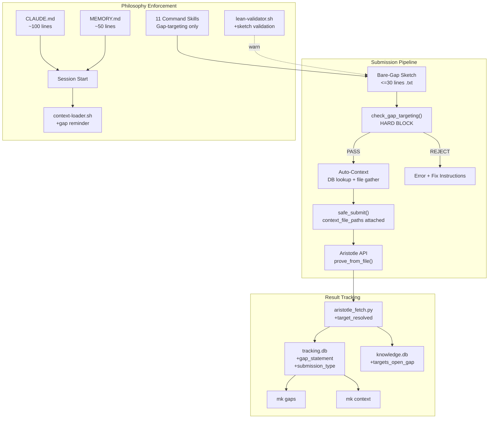
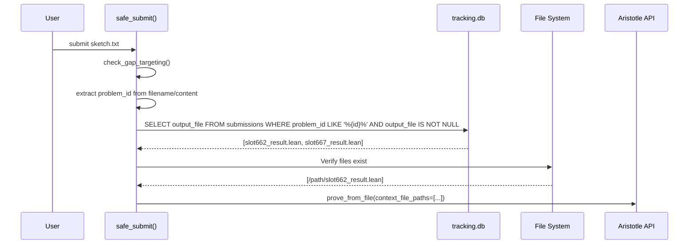
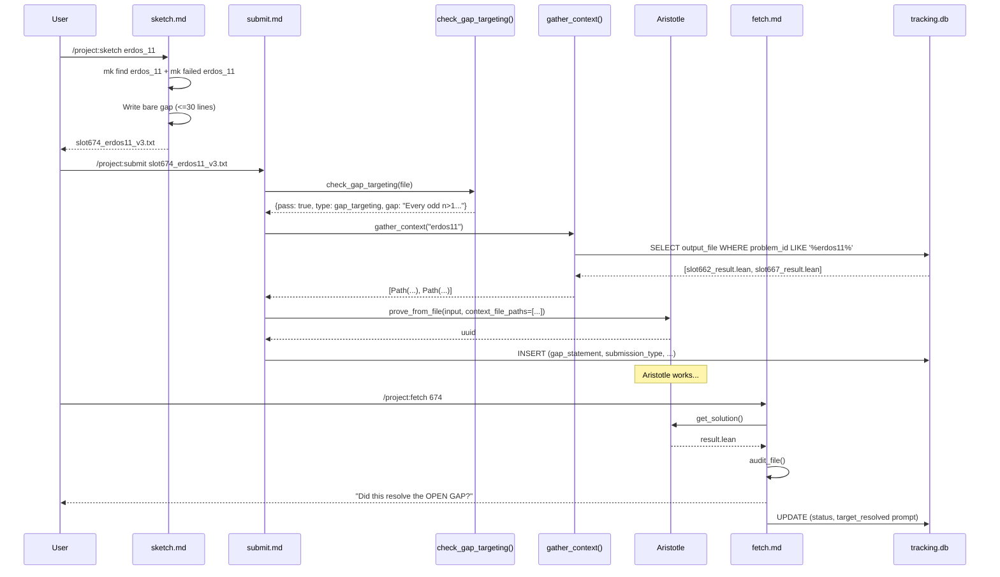

# Design: Gap-Targeting Pivot

## Overview

Rewrite all project scaffolding to enforce gap-targeting ONLY on Aristotle submissions. Three enforcement layers: (1) `check_gap_targeting()` hard-blocks non-gap submissions in `safe_aristotle_submit.py`, (2) auto-context gathers prior `_result.lean` files via DB lookup and passes them as `context_file_paths`, (3) rewritten docs/skills/hooks make gap-targeting the only expressible workflow. ~25 files modified, zero API changes to aristotlelib.

## Architecture



## Components

### 1. check_gap_targeting() — Hard Block

**Location**: `/Users/patrickkavanagh/math/scripts/safe_aristotle_submit.py`
**Purpose**: Reject all non-gap-targeting submissions before any API call.

**Interface**:
```python
class GapTargetingError(SubmissionError):
    """Raised when a submission fails gap-targeting validation."""
    pass

def check_gap_targeting(input_file: Path) -> dict:
    """Validate that input_file targets an open gap.

    Returns:
        {"pass": True, "submission_type": "gap_targeting"|"falsification",
         "gap_statement": str, "line_count": int}

    Raises:
        GapTargetingError with actionable fix message.
    """
```

**Validation Logic** (ordered, first failure stops):

| Check | Condition | Error Message |
|-------|-----------|---------------|
| C1: File extension | `.lean` file | "Gap-targeting requires INFORMAL (.txt). Convert to bare conjecture sketch." |
| C2: Empty file | 0 bytes or whitespace-only | "Sketch is empty. Write the bare conjecture statement." |
| C3: Line count | >30 non-blank lines | "Sketch has {N} lines (max 30). Strip proof strategy — state only the open gap." |
| C4: Strategy keywords | Any line matches pattern | "Sketch contains proof guidance ('{keyword}'). Remove all strategy — let Aristotle find the path." |
| C5: Lean code block | >5 lines of Lean-like content | "Sketch contains extended Lean code. Use only 1-3 lines for the formal statement." |

**Strategy keyword patterns** (case-insensitive regex):
```python
STRATEGY_PATTERNS = [
    r'(?i)^#+\s*(proof\s+strategy|proposed\s+(strategy|approach)|key\s+lemma)',
    r'(?i)^#+\s*(main\s+proof|proof\s+assembly|proof\s+outline)',
    r'(?i)^APPROACH\s+\d',
    r'(?i)^FALLBACK\s+\d',
    r'(?i)^(PRIMARY|SECONDARY):\s',
    r'(?i)^###?\s+Lemma\s+\d',
    r'(?i)^\s*Proposed\s+proof:',
    r'(?i)^=+\s*(PROOF|WHAT TO PROVE|APPROACH)',
]
```

**Falsification detection**:
```python
FALSIFICATION_PATTERNS = [
    r'(?i)\b(falsif|disprove|counterexample|negat)',
    r'(?i)\bis\s+this\s+(true|false|real)',
    r'(?i)\btest\s+(whether|if)',
]
```

If any falsification pattern matches AND no strategy patterns match, `submission_type = "falsification"`.

**Gap statement extraction**: First non-blank line after removing comment markers (`#`, `--`). Stored in DB as `gap_statement`.

**Integration point**: Called at the top of `safe_submit()`, before lockfile check:

```python
async def safe_submit(input_file, ...):
    # NEW: Gap-targeting gate (runs before all other checks)
    gap_info = check_gap_targeting(input_file)
    # gap_info used later to populate DB fields
    ...
```

**Line counting**: Non-blank lines only. Lines containing only `#`, `---`, or whitespace are excluded.

### 2. Bare-Gap Sketch Template

**Location**: `/Users/patrickkavanagh/math/.claude/commands/sketch.md`
**Format** (target: 5-15 lines, max 30):

```
OPEN GAP: [Problem Name]
Source: [formal-conjectures path or Erdos number]
Domain: [nt / algebra / combinatorics / analysis]

[1-3 sentence English statement of the unsolved conjecture]

theorem problem_name (vars : Types) : conclusion := by sorry

Status: OPEN. [One sentence on what's known — "verified to N=10^6", "open since 1971"]
```

**What is NOT in the template**: No "Proof Strategy", no "Key Lemmas", no "Proposed Approach", no "Computational Evidence", no "Relevant Mathlib", no "What To Prove", no "Fallback" options, no multiple approaches.

**Sketch generation workflow** (replaces old 7-step IDEATE+SKETCH):

```
Step 1: Identify the open gap (read file/URL, confirm it's open)
Step 2: Check mk failed + mk find (avoid known dead problems)
Step 3: Write bare sketch (template above)
Step 4: Auto-assign slot, save to submissions/sketches/
Step 5: Report + "run /project:submit <file>"
```

### 3. Auto-Context Attachment

**Location**: Modified `safe_submit()` in `safe_aristotle_submit.py` and new `gather_context()` function.

**Data Flow**:


**Interface**:
```python
def extract_problem_id(input_file: Path) -> str | None:
    """Extract problem ID from sketch filename or content.

    Filename patterns:
        slot662_erdos11_squarefree_pow2.txt -> "erdos11"
        slot670_erdos375_grimm.txt -> "erdos375_grimm"
        slot649_gilbreath_conjecture.txt -> "gilbreath"

    Content patterns:
        "OPEN GAP: Erdos Problem 11" -> "erdos_11"
        First line after "OPEN GAP:" header

    Returns None if no ID extractable.
    """

def gather_context(problem_id: str) -> list[Path]:
    """Find all prior _result.lean files for this problem.

    Queries tracking.db:
        SELECT output_file FROM submissions
        WHERE problem_id LIKE '%{problem_id}%'
          AND output_file IS NOT NULL
          AND status IN ('compiled_clean', 'near_miss', 'completed')
        ORDER BY completed_at DESC

    Returns list of existing Paths (filters out missing files).
    Empty list if no matches (not an error).
    """
```

**Integration**: Auto-context runs after `check_gap_targeting()` passes. Context files are merged with any explicitly passed `--context` files. Logged to transaction log.

**problem_id extraction algorithm**:
1. Parse filename: strip `slot\d+_` prefix, strip `.txt` suffix, take remaining as `problem_id`
2. If filename gives nothing useful, read first 5 lines of file, look for `OPEN GAP:` line
3. Normalize: lowercase, strip spaces/underscores, truncate at 50 chars
4. Return `None` if ambiguous (safe: no context attached, no error)

### 4. mk context Command

**Location**: `/Users/patrickkavanagh/math/math-forge/scripts/mk` (new case block)

**Interface**:
```bash
mk context <problem_id>
# Output:
# [math-forge] Context files for erdos_11:
#   /Users/.../slot662_erdos11_result.lean (compiled_clean, 117 lines)
#   /Users/.../slot667_erdos11_v2_result.lean (near_miss, 235 lines)
# Pass to submit: --context /path/file1.lean --context /path/file2.lean
```

**Implementation**:
```bash
context)
    shift
    check_db || exit 1
    if [ $# -eq 0 ]; then
        echo "Usage: mk context <problem-id>"
        echo "  Lists prior Aristotle result files for passing as context."
        exit 1
    fi
    PROBLEM=$(escape_sql "$1")
    NORM_PROBLEM=$(normalize_problem "$1")

    if [ ! -f "$TRACKING_DB" ]; then
        echo "[math-forge] ERROR: tracking.db not found" >&2
        exit 1
    fi

    echo "[math-forge] Context files for '${1}':"
    echo "---"

    # Query tracking.db for result files matching problem_id
    RESULTS=$(run_sql "$TRACKING_DB" "
        SELECT output_file, status, proven_count
        FROM submissions
        WHERE (problem_id LIKE '%${PROBLEM}%'
               OR filename LIKE '%${NORM_PROBLEM}%')
          AND output_file IS NOT NULL
          AND status IN ('compiled_clean', 'near_miss', 'completed', 'disproven')
        ORDER BY completed_at DESC;
    ")

    if [ -z "$RESULTS" ]; then
        echo "  (No prior results found)"
        echo ""
        echo "This is the first submission for this problem."
    else
        CONTEXT_ARGS=""
        while IFS='|' read -r filepath status proven; do
            if [ -f "$filepath" ]; then
                LINES=$(wc -l < "$filepath" | tr -d ' ')
                printf "  %s (%s, %s lines)\n" "$filepath" "$status" "$LINES"
                CONTEXT_ARGS="${CONTEXT_ARGS} --context ${filepath}"
            else
                printf "  %s (MISSING — file not found)\n" "$filepath"
            fi
        done <<< "$RESULTS"
        echo "---"
        echo "Submit with:${CONTEXT_ARGS}"
    fi
    ;;
```

**BATS test impact**: New command, no existing tests affected. New test file `test_mk_context.bats` needed.

### 5. mk gaps Command

**Location**: `/Users/patrickkavanagh/math/math-forge/scripts/mk` (new case block)

**Interface**:
```bash
mk gaps
# Output:
# [math-forge] Open Gaps Being Targeted
# ===
# Problem         Gap Statement                              Subs  Best Result
# erdos_11        Every odd n>1 = squarefree + 2^k           3     near_miss (slot667)
# gilbreath       Gilbreath's conjecture                     1     completed (slot649)
# sierpinski_5n   5/n = 1/x + 1/y + 1/z for all n>=1        4     compiled_clean (slot655)
```

**Implementation**:
```bash
gaps)
    shift
    if [ ! -f "$TRACKING_DB" ]; then
        echo "[math-forge] ERROR: tracking.db not found" >&2
        exit 1
    fi

    echo "[math-forge] Open Gaps Being Targeted"
    echo "==="

    run_sql "$TRACKING_DB" -header -column "
        SELECT
            COALESCE(problem_id, filename) as problem,
            COALESCE(gap_statement, SUBSTR(notes, 1, 60)) as gap,
            COUNT(*) as submissions,
            MAX(CASE WHEN status = 'compiled_clean' THEN 'compiled_clean'
                     WHEN status = 'near_miss' THEN 'near_miss'
                     WHEN status = 'completed' THEN 'completed'
                     ELSE status END) as best_status,
            MAX(CASE WHEN target_resolved = 1 THEN 'RESOLVED' ELSE '' END) as resolved
        FROM submissions
        WHERE submission_type = 'gap_targeting'
           OR submission_type IS NULL
        GROUP BY COALESCE(problem_id, filename)
        HAVING MAX(target_resolved) = 0
        ORDER BY submissions DESC;
    "

    RESOLVED=$(run_sql "$TRACKING_DB" "
        SELECT COUNT(*) FROM submissions WHERE target_resolved = 1;
    ")
    echo ""
    echo "Gaps resolved: ${RESOLVED:-0}"
    ;;
```

### 6. CLAUDE.md Rewrite Structure

**Target**: ~100-120 lines (down from 273). Single-phase pipeline.

```markdown
# CLAUDE.md - Math Project

## Mission
Solve open mathematical problems by submitting bare conjecture statements to Aristotle.

## The Pipeline (2 steps)
1. **GAP**: Identify the open gap — the exact unsolved conjecture
2. **SUBMIT**: State it bare (<=30 lines), attach prior results as context, submit INFORMAL

## Sketch Format
[Template: OPEN GAP / English statement / Lean statement / Status. Nothing else.]

## Hard Rules
1. Every submission targets an OPEN GAP — no known results, no infrastructure
2. Sketches are bare conjecture statements — no proof strategy, no lemmas, no guidance
3. <=30 lines per sketch
4. INFORMAL only (.txt) — no .lean submissions
5. Prior Aristotle results auto-attached as context
6. No override on the gap-targeting gate — rejection is final
7. Falsification is valid gap-targeting ("is this gap real?")
8. HAVE FAITH IN ARISTOTLE — submit aggressively, fear nothing

## Commands
[Simplified command list — same commands, gap-targeting descriptions]

## math-forge CLI
mk search / mk find / mk failed / mk context / mk gaps / mk stats

## Database
tracking.db: submissions (with gap_statement, submission_type)
knowledge.db: findings, strategies, problems

## When Stuck
1. mk failed <keywords> — already disproven?
2. mk context <problem> — what did Aristotle try before?
3. Try a different problem — plenty of open gaps
4. Run /project:debate to identify the exact gap
```

**What is removed**: IDEATE phase, Tracks A-D, case studies, multi-agent strategy table, Lean pitfalls section, detailed proof state (Tuza), subagent prompt rules, decision priority matrix, Track D kill list, old sketch template (50-100 lines).

### 7. MEMORY.md Simplification

**Target**: ~40-50 lines.

```markdown
# Memory - Math Project

## PRIME DIRECTIVE
Gap-targeting ONLY. State the bare open gap. Let Aristotle find the path.
No proof strategies. No known results. No infrastructure.

## HARD RULES
- Sketches: <=30 lines, bare conjecture, zero proof guidance
- Submissions: INFORMAL .txt only, auto-context attached
- Pipeline gate: check_gap_targeting() — no override
- "compiled clean" != "resolved the gap" — only celebrate gap resolutions

## Falsified Approaches (keep — prevents repeats)
[Preserved from current MEMORY.md]

## User Directives
1. "HAVE FAITH IN ARISTOTLE. DO NOT BE AFRAID OF FAILURE."
2. "Stop saying PROVEN for infrastructure"
3. "Gap-targeting only — bare conjecture, zero guidance"
```

**What is removed**: Detailed track record, FT p=3 case status table, old in-flight list, tooling fixes, "What NOT to Do" (subsumed by hard rules).

### 8. tracking.db Schema Migration

**Migration SQL** (non-breaking ALTER TABLE):
```sql
ALTER TABLE submissions ADD COLUMN gap_statement TEXT;
ALTER TABLE submissions ADD COLUMN submission_type TEXT;
```

**No CHECK constraint on submission_type** — SQLite ALTER TABLE cannot add CHECK constraints. Validation enforced in Python code. Allowed values: `gap_targeting`, `falsification`, `NULL` (legacy).

**Integration**: `safe_submit()` populates both columns from `check_gap_targeting()` return value:
```python
# After successful submission, in the DB INSERT:
gap_info = check_gap_targeting(input_file)
# ... in DB record:
# gap_statement = gap_info["gap_statement"]
# submission_type = gap_info["submission_type"]
```

**Backward compatibility**: Existing rows have `NULL` for both columns. `mk gaps` query handles `NULL` with `COALESCE`.

### 9. knowledge.db Schema Changes

**Non-breaking change** (ALTER TABLE):
```sql
ALTER TABLE findings ADD COLUMN targets_open_gap INTEGER DEFAULT 0;
ALTER TABLE findings ADD COLUMN gap_id TEXT;
```

**Deferred**: Adding `gap_progress` to finding_type CHECK constraint requires table recreation. This is low priority and can be done in a separate migration script:

```python
# Standard SQLite table recreation pattern:
# 1. CREATE TABLE findings_new (...new CHECK constraint...)
# 2. INSERT INTO findings_new SELECT * FROM findings
# 3. DROP TABLE findings
# 4. ALTER TABLE findings_new RENAME TO findings
# 5. Recreate indexes, triggers, FTS table
```

**Recommendation**: Defer CHECK constraint expansion to a separate task. The `targets_open_gap` column and `gap_id` column are sufficient for tracking without the new finding_type.

### 10. Hook Updates

#### context-loader.sh

Add gap-targeting reminder to briefing output (line ~51):
```bash
# After BRIEFING initialization, before action items:
BRIEFING="${BRIEFING}

GAP-TARGETING: Bare conjecture only. No proof guidance. Let Aristotle find the path."
```

**BATS impact**: Existing tests check for `[math-forge]` header, valid JSON, `hookSpecificOutput`, `additionalContext`. All still pass — we're adding content, not changing structure.

#### lean-validator.sh

Add sketch validation for .txt files. Currently exits early for non-.lean files (line 22). Change:

```bash
# Replace early exit for non-.lean with sketch check for .txt
if [[ "$FILE_PATH" == *.txt ]] && [[ "$FILE_PATH" == *sketch* || "$FILE_PATH" == *slot* ]]; then
    # Check for proof strategy patterns in sketch files
    SKETCH_WARNINGS=()
    if grep -qiE '(Proof Strategy|Key Lemma|APPROACH [0-9]|Main Proof|Proposed Strategy)' "$FILE_PATH" 2>/dev/null; then
        SKETCH_WARNINGS+=("[math-forge] WARNING: Sketch contains proof guidance. Gap-targeting: state only the bare conjecture.")
    fi
    LINE_COUNT=$(grep -cv '^\s*$' "$FILE_PATH" 2>/dev/null || echo 0)
    if [ "$LINE_COUNT" -gt 30 ]; then
        SKETCH_WARNINGS+=("[math-forge] WARNING: Sketch has ${LINE_COUNT} lines (max 30 for gap-targeting).")
    fi
    if [ ${#SKETCH_WARNINGS[@]} -gt 0 ]; then
        COMBINED=""
        for w in "${SKETCH_WARNINGS[@]}"; do
            COMBINED="${COMBINED:+$COMBINED | }${w}"
        done
        ESCAPED_REASON=$(printf '%s' "$COMBINED" | sed 's/"/\\"/g')
        echo "{\"hookSpecificOutput\": {\"hookEventName\": \"PostToolUse\", \"additionalContext\": \"${ESCAPED_REASON}\"}}"
    fi
    exit 0
fi

if [[ -z "$FILE_PATH" ]] || [[ "$FILE_PATH" != *.lean ]]; then
    exit 0
fi
```

**hooks.json**: No change needed. The PostToolUse hook already fires on `Write|Edit` which covers .txt file writes. The lean-validator.sh script just needs to handle .txt files internally.

**BATS impact**: Existing tests all use `.lean` files. The new .txt path won't interfere. Add new test:

```bash
@test "lean-validator: warns on strategy keywords in sketch" {
    local tmpfile=$(mktemp /tmp/slot999_sketch_XXXXXX.txt)
    echo "## Proof Strategy\nApproach 1: by induction\nKey Lemma: foo" > "$tmpfile"
    run bash -c 'echo "{\"tool_input\":{\"file_path\":\"'"$tmpfile"'\"},\"tool_name\":\"Write\"}" | bash '"$HOOK"
    [ "$status" -eq 0 ]
    assert_output_contains "WARNING"
    rm -f "$tmpfile"
}
```

### 11. Skill Rewrites Summary

| Skill | Key Changes | Lines (est) |
|-------|-------------|-------------|
| sketch.md | Strip IDEATE phase, remove strategy template, bare-gap template only, 5-step workflow | ~60 (from 218) |
| submit.md | Add check_gap_targeting() call at Step 1, remove FORMAL paths, add auto-context step | ~80 (from 180) |
| sweep.md | Single tier (OPEN), remove Tiers B/C/D, find gaps -> state bare -> submit | ~60 (from 170) |
| screen.md | Binary: OPEN -> submit, NOT OPEN -> skip. No scoring. | ~30 (from 103) |
| screen-batch.md | Binary: OPEN vs SKIP. No tiers. | ~30 (from 81) |
| fetch.md | Add target_resolved prompt after audit | ~90 (from 81) |
| audit.md | Replace novelty (FIRST-EVER/etc) with gap-resolution assessment | ~80 (from 125) |
| process-result.md | Add target_resolved assessment step | ~80 (from 115) |
| optimize.md | Single recommendation: "State gap bare, submit INFORMAL" | ~30 (from 108) |
| debate.md | Focus on "identify the exact open gap" not "develop proof strategy" | ~80 (from 97) |
| status.md | No change | 21 |

### 12. Math-Forge Skill Changes

| Skill | Action | Rationale |
|-------|--------|-----------|
| open-problems.md | Rewrite: query KB for prior results only, no strategy proposals | Prior results inform Aristotle via context, not via sketch content |
| number-theory.md | Minor rewrite: keep KB queries, remove "proven techniques" focus | mk failed still prevents repeats |
| proof-strategies.md | Rename to `prior-results.md`: surfaces what Aristotle tried, not what WE should try | We don't choose strategies; Aristotle does |

### 13. aristotle_fetch.py Changes

Add `target_resolved` assessment prompt after audit. In `cmd_fetch()`, after downloading and auditing:

```python
# After audit, prompt for target_resolved assessment
if audit["verdict"] == "compiled_clean":
    print(f"  Did this result resolve the OPEN GAP (not just compile infrastructure)?")
    print(f"  Set target_resolved=1 manually if yes:")
    print(f"  sqlite3 submissions/tracking.db \"UPDATE submissions SET target_resolved=1 WHERE uuid='{uuid}'\"")
```

**No automatic classification**. `target_resolved` requires human judgment. The fetch script surfaces the question; the user answers.

### 14. extract_findings.py Changes

Add `targets_open_gap` and `gap_id` to finding INSERT:

```python
# In generate_finding(), add fields to INSERT:
# targets_open_gap: default 0, set to 1 if the finding resolves an open gap
# gap_id: problem_id from the submission record
```

Minimal change — just pass through the new columns with defaults. The `gap_progress` finding_type is deferred until CHECK constraint migration.

## Data Flow



## Technical Decisions

| Decision | Options Considered | Choice | Rationale |
|----------|-------------------|--------|-----------|
| Line count threshold | 10, 20, 30, 50 | 30 | Bare gap = 5-15 lines. 30 allows formal statement + brief status. Requirements settled this in interview. |
| Strategy detection | Regex only, NLP, LLM-based | Regex patterns | Fast (<1ms), deterministic, no dependencies. 8 patterns cover all observed sketch structures. |
| Context auto-detection | Filename only, content only, both | Filename first, content fallback | Filename is fast and reliable for slot-named files. Content fallback for edge cases. |
| target_resolved | Automatic, manual, LLM-assisted | Manual with prompt | Human judgment required. Automation would be unreliable. Prompt surfaces the question. |
| Override mechanism | --force flag, env var, none | None | User directive: "No overrides." Hard block is hard. |
| .lean submission | Block, allow with warning, allow for sorry=0 | Block all | Gap-targeting = INFORMAL only. .lean is infrastructure/verification. Requirements explicit. |
| knowledge.db CHECK expansion | Immediate migration, defer | Defer | Table recreation is disruptive. New columns suffice. Separate task later. |
| Falsification | Block, allow as special type | Allow as gap_targeting subtype | "Is this gap real?" is a valid question about the gap. Tagged separately in DB. |
| mk CLI new commands | Separate script, subcommands in mk | Subcommands in mk | Consistent with existing pattern. No new files needed. |
| Hook for .txt validation | New hook, extend lean-validator | Extend lean-validator | lean-validator already runs on Write|Edit. Adding .txt branch is minimal. Advisory warning, not block. |

## File Structure

| File | Action | Purpose |
|------|--------|---------|
| `scripts/safe_aristotle_submit.py` | Modify | Add `check_gap_targeting()`, `extract_problem_id()`, `gather_context()`, `GapTargetingError` |
| `scripts/aristotle_fetch.py` | Modify | Add `target_resolved` prompt after audit in `cmd_fetch()` |
| `CLAUDE.md` | Rewrite | ~100 lines, single-phase pipeline, gap-targeting only |
| `~/.claude/.../MEMORY.md` | Rewrite | ~50 lines, gap-targeting mandate |
| `.claude/commands/sketch.md` | Rewrite | Bare-gap template, 5-step workflow |
| `.claude/commands/submit.md` | Rewrite | Gap-targeting gate, auto-context, INFORMAL only |
| `.claude/commands/sweep.md` | Rewrite | Single tier: open gaps |
| `.claude/commands/screen.md` | Rewrite | Binary: OPEN vs SKIP |
| `.claude/commands/screen-batch.md` | Rewrite | Binary: OPEN vs SKIP |
| `.claude/commands/fetch.md` | Modify | Add target_resolved assessment |
| `.claude/commands/audit.md` | Modify | Replace novelty with gap-resolution |
| `.claude/commands/process-result.md` | Modify | Add target_resolved assessment |
| `.claude/commands/optimize.md` | Rewrite | Single recommendation: bare gap + INFORMAL |
| `.claude/commands/debate.md` | Modify | Focus on gap identification |
| `math-forge/skills/open-problems.md` | Rewrite | Query KB for prior results only |
| `math-forge/skills/number-theory.md` | Modify | Remove strategy focus |
| `math-forge/skills/proof-strategies.md` | Rename/Rewrite | Become `prior-results.md` |
| `math-forge/hooks/scripts/context-loader.sh` | Modify | Add gap-targeting reminder to briefing |
| `math-forge/hooks/scripts/lean-validator.sh` | Modify | Add .txt sketch validation |
| `math-forge/scripts/mk` | Modify | Add `context` and `gaps` commands, update help text |
| `math-forge/data/schema.sql` | Modify | Add `targets_open_gap`, `gap_id` columns to findings |
| `math-forge/scripts/extract_findings.py` | Modify | Pass through new columns |
| `math-forge/tests/test_mk_context.bats` | Create | Tests for `mk context` command |
| `math-forge/tests/test_mk_gaps.bats` | Create | Tests for `mk gaps` command |
| `math-forge/tests/test_gap_targeting.bats` | Create | Tests for lean-validator sketch check |

## Error Handling

| Error Scenario | Handling Strategy | User Impact |
|----------------|-------------------|-------------|
| .lean file submitted | GapTargetingError, exit 1 | "Convert to bare .txt sketch" message |
| Sketch >30 lines | GapTargetingError, exit 1 | Shows line count, instructs to strip strategy |
| Strategy keywords found | GapTargetingError, exit 1 | Shows matched keyword, instructs to remove |
| No problem_id extractable | Skip auto-context (no error) | Submission proceeds without context |
| Context files missing from disk | Filter out missing, continue | Warning logged, available files still attached |
| DB columns missing (pre-migration) | Catch sqlite3 error, skip column writes | Graceful degradation for pre-migration state |
| In-flight submissions (slot646-673) | No impact — gate only applies to NEW submissions | Fetch/process unchanged |

## Edge Cases

- **Falsification sketch with strategy-like content**: Falsification patterns checked FIRST. If falsification detected, strategy check is skipped. Prevents false-positive blocking of "test if X is false by checking Y" sketches.
- **Multi-line Lean theorem statement**: Lean code block check allows up to 5 lines of Lean-like content (lines starting with `theorem`, `def`, `import`, containing `:=`, `by`, type signatures). Only blocks >5 lines (which suggests scaffold, not statement).
- **Legacy sketches in submissions/**: Gate only runs on NEW submissions. Existing files in `submissions/sketches/` are untouched.
- **Empty problem_id in DB**: `gather_context()` returns empty list. No error. Submission proceeds without context.
- **Multiple problems with similar IDs**: `LIKE '%erdos11%'` may match `erdos110`. Mitigated by `normalize_problem()` matching pattern. Accept imprecise matching — extra context doesn't hurt.

## Test Strategy

### Unit Tests (BATS)

**New test file: `test_mk_context.bats`**
```bash
@test "context: no args shows usage"
@test "context: lists result files for known problem"
@test "context: handles no prior results gracefully"
@test "context: shows MISSING for deleted files"
```

**New test file: `test_mk_gaps.bats`**
```bash
@test "gaps: shows header"
@test "gaps: lists problems with submissions"
@test "gaps: shows resolved count"
```

**New test file: `test_gap_targeting.bats`**
```bash
@test "lean-validator: warns on strategy keywords in .txt sketch"
@test "lean-validator: passes clean bare-gap sketch"
@test "lean-validator: warns on >30 line sketch"
```

**Modified: `test_mk_utils.bats`**
```bash
@test "help: shows context command"
@test "help: shows gaps command"
```

### Integration Tests (manual)

- Submit a bare-gap .txt sketch (<30 lines, no strategy) -> PASS
- Submit a strategy-heavy .txt sketch (>30 lines, has "Proof Strategy") -> REJECT
- Submit a .lean file -> REJECT
- Submit a falsification .txt sketch -> PASS (tagged as falsification)
- Submit with auto-context (prior results exist) -> context files attached
- Submit with no prior results -> proceeds without context, no error
- Fetch a result -> target_resolved prompt shown

### Regression

- All 32 existing BATS tests pass unchanged
- In-flight submissions (slot646-673) fetchable without issues
- `mk search`, `mk find`, `mk stats`, `mk failed`, `mk strategies` all work

## Performance Considerations

- `check_gap_targeting()`: File read + regex = <50ms. Well under NFR-2 (2 sec).
- `gather_context()`: Single DB query + file existence checks = <100ms.
- `extract_problem_id()`: Filename parse = <1ms. Content fallback = <10ms.
- Schema migration: ALTER TABLE = instant.

## Security Considerations

- No new external dependencies introduced.
- `escape_sql()` used for all user input in mk CLI (existing pattern).
- No new file write paths — context files are read-only inputs.
- Transaction log appended (existing pattern).

## Existing Patterns to Follow

Based on codebase analysis:
- **mk CLI pattern**: `case` statement switch, `check_db || exit 1`, `run_sql`, `escape_sql`, `normalize_problem`
- **safe_aristotle_submit.py pattern**: SubmissionError class, numbered safety checks, lockfile/duplicate/rate-limit sequence, log_transaction()
- **BATS test pattern**: `load test_helper`, `setup_test_db`/`teardown_test_db`, `assert_output_contains`, temp file cleanup
- **Hook output pattern**: JSON with `hookSpecificOutput.additionalContext` for warnings, `{"decision": "block", "reason": ...}` for blocks
- **DB update pattern**: Check existence with SELECT, then UPDATE or INSERT. sqlite3 connect/execute/commit/close.

## Implementation Steps

1. **Schema migration**: Run ALTER TABLE on tracking.db (add `gap_statement`, `submission_type`). Add columns to schema.sql for knowledge.db.
2. **CLAUDE.md rewrite**: ~100 lines, single-phase pipeline.
3. **MEMORY.md simplification**: ~50 lines, gap-targeting mandate.
4. **safe_aristotle_submit.py**: Add `GapTargetingError`, `check_gap_targeting()`, `extract_problem_id()`, `gather_context()`. Wire into `safe_submit()`.
5. **sketch.md rewrite**: Bare-gap template, 5-step workflow.
6. **submit.md rewrite**: Gap-targeting gate, auto-context, INFORMAL only.
7. **sweep.md rewrite**: Single tier, open gaps only.
8. **mk CLI**: Add `context` and `gaps` commands, update help text.
9. **screen.md + screen-batch.md**: Binary OPEN/SKIP.
10. **fetch.md + process-result.md + audit.md**: Add target_resolved assessment.
11. **optimize.md + debate.md**: Simplify to gap-targeting.
12. **Math-forge skills**: Rewrite open-problems.md, number-theory.md, rename proof-strategies.md.
13. **context-loader.sh**: Add gap-targeting reminder.
14. **lean-validator.sh**: Add .txt sketch validation.
15. **aristotle_fetch.py**: Add target_resolved prompt.
16. **extract_findings.py**: Pass through new columns.
17. **BATS tests**: New test files for context, gaps, gap-targeting. Update help test.
18. **Run full BATS suite**: `bats math-forge/tests/` — all 32+ tests must pass.
