# Design: Honest Tooling

## Overview

Replace `proven` status/labels with `compiled_clean` across tracking.db and all scripts that read/write it. Split the monolithic `check_recent_submissions()` into separate duplicate/rate-limit functions, add `--batch` multi-file submission, and extend the `mk` CLI with 5 new commands. Migration runs first; all code changes are backward-compatible.

## Architecture


## Implementation Order

| Step | File | FR | Depends On |
|------|------|----|------------|
| 0 | Migration SQL (inline in design) | FR-2 | Nothing |
| 1 | `scripts/aristotle_fetch.py` | FR-1, FR-14 | Migration |
| 2 | `scripts/backfill_slots.py` | FR-5 | Migration |
| 3 | `scripts/backfill_all_files.py` | FR-5 | Migration |
| 4 | `scripts/audit_proven.py` | FR-3 | Migration |
| 5 | `scripts/verify_output.sh` | FR-4 | Nothing |
| 6 | `scripts/post_result.sh` | FR-15 | Nothing |
| 7 | `scripts/safe_aristotle_submit.py` | FR-6, FR-7 | Nothing |
| 8 | `math-forge/scripts/mk` | FR-8..FR-13 | Step 7 |

## Step 0: Database Migration

Run this SQL against `submissions/tracking.db` before any code changes.

```sql
-- Step 1: Add target_resolved column
ALTER TABLE submissions ADD COLUMN target_resolved INTEGER DEFAULT 0;

-- Step 2: Rename proven → compiled_clean
UPDATE submissions SET status = 'compiled_clean' WHERE status IN ('proven', 'PROVEN');
```

**Execution**: Run via `sqlite3 submissions/tracking.db < migration.sql` or inline in implementation script.

**Idempotent**: ALTER TABLE will error if column exists (catch and continue). UPDATE is idempotent (no rows match after first run).

**Implementation pattern** for the migration script:

```python
#!/usr/bin/env python3
"""One-shot migration: proven -> compiled_clean + add target_resolved."""
import sqlite3
import sys
from pathlib import Path

DB_PATH = Path(__file__).resolve().parent.parent / "submissions" / "tracking.db"

def migrate():
    conn = sqlite3.connect(str(DB_PATH))

    # Step 1: Add target_resolved column (idempotent)
    try:
        conn.execute("ALTER TABLE submissions ADD COLUMN target_resolved INTEGER DEFAULT 0")
        print("Added target_resolved column")
    except sqlite3.OperationalError as e:
        if "duplicate column" in str(e).lower():
            print("target_resolved column already exists")
        else:
            raise

    # Step 2: Rename status
    changed = conn.execute(
        "UPDATE submissions SET status = 'compiled_clean' WHERE status IN ('proven', 'PROVEN')"
    ).rowcount
    print(f"Migrated {changed} rows: proven -> compiled_clean")

    conn.commit()
    conn.close()

if __name__ == "__main__":
    migrate()
```

**File**: `scripts/migrate_honest_labels.py` (new file, ~25 lines)

---

## Step 1: `scripts/aristotle_fetch.py`

### Change 1.1: Verdict assignment (line 134-135)

```python
# BEFORE (line 134-135):
    elif sorry_count == 0 and axiom_count == 0 and not has_negation:
        verdict = "proven"

# AFTER:
    elif sorry_count == 0 and axiom_count == 0 and not has_negation:
        verdict = "compiled_clean"
```

### Change 1.2: DB verified column — UPDATE path (line 175)

```python
# BEFORE (line 175):
            1 if audit["verdict"] == "proven" else 0,

# AFTER:
            1 if audit["verdict"] == "compiled_clean" else 0,
```

### Change 1.3: DB verified column — INSERT path (line 192)

```python
# BEFORE (line 192):
            1 if audit["verdict"] == "proven" else 0,

# AFTER:
            1 if audit["verdict"] == "compiled_clean" else 0,
```

### Change 1.4: Display in cmd_status (line 264)

```python
# BEFORE (line 264):
            emoji = "✅" if verdict == "PROVEN" else "📝" if verdict == "NEAR_MISS" else "❌"

# AFTER:
            emoji = "✅" if verdict == "COMPILED_CLEAN" else "📝" if verdict == "NEAR_MISS" else "❌"
```

### Change 1.5: Display in cmd_fetch (line 372)

```python
# BEFORE (line 372):
            emoji = "✅" if verdict == "PROVEN" else "📝" if verdict == "NEAR_MISS" else "⚠️"

# AFTER:
            emoji = "✅" if verdict == "COMPILED_CLEAN" else "📝" if verdict == "NEAR_MISS" else "⚠️"
```

### Change 1.6: Counter in cmd_fetch (line 380)

```python
# BEFORE (line 380):
            if verdict == "PROVEN":
                proven += 1

# AFTER:
            if verdict == "COMPILED_CLEAN":
                proven += 1
```

### Change 1.7: Summary line in cmd_fetch (line 387)

```python
# BEFORE (line 387):
    print(f"Done: {fetched} fetched, {proven} proven.")

# AFTER:
    print(f"Done: {fetched} fetched, {proven} compiled clean.")
```

### Change 1.8: Add target_resolved to UPDATE path (lines 161-178)

Add `target_resolved` to the UPDATE statement. Default to 0; it will be set manually.

```python
# BEFORE (lines 161-178):
    if row:
        db.execute("""
            UPDATE submissions SET
                status = ?,
                sorry_count = ?,
                proven_count = ?,
                verified = ?,
                completed_at = datetime('now'),
                output_file = ?,
                notes = ?
            WHERE uuid = ?
        """, (
            audit["verdict"],
            audit["sorry"],
            audit["declarations"],
            1 if audit["verdict"] == "compiled_clean" else 0,
            output_file,
            f"Auto-fetched. {audit['lines']} lines, {audit['sorry']} sorry, {audit['axioms']} axiom.",
            uuid,
        ))

# AFTER:
    if row:
        db.execute("""
            UPDATE submissions SET
                status = ?,
                sorry_count = ?,
                proven_count = ?,
                verified = ?,
                target_resolved = ?,
                completed_at = datetime('now'),
                output_file = ?,
                notes = ?
            WHERE uuid = ?
        """, (
            audit["verdict"],
            audit["sorry"],
            audit["declarations"],
            1 if audit["verdict"] == "compiled_clean" else 0,
            0,  # target_resolved: set manually when an open problem is actually resolved
            output_file,
            f"Auto-fetched. {audit['lines']} lines, {audit['sorry']} sorry, {audit['axioms']} axiom.",
            uuid,
        ))
```

### Change 1.9: Add target_resolved to INSERT path (lines 181-195)

```python
# BEFORE (lines 182-195):
    else:
        filename = f"slot{slot_num}"
        db.execute("""
            INSERT INTO submissions (filename, uuid, status, sorry_count, proven_count, verified,
                completed_at, output_file, frontier_id, notes, submitted_at)
            VALUES (?, ?, ?, ?, ?, ?, datetime('now'), ?, 'formal_conjectures', ?, datetime('now'))
        """, (
            filename,
            uuid,
            audit["verdict"],
            audit["sorry"],
            audit["declarations"],
            1 if audit["verdict"] == "compiled_clean" else 0,
            output_file,
            f"{task}. {audit['lines']} lines.",
        ))

# AFTER:
    else:
        filename = f"slot{slot_num}"
        db.execute("""
            INSERT INTO submissions (filename, uuid, status, sorry_count, proven_count, verified,
                target_resolved, completed_at, output_file, frontier_id, notes, submitted_at)
            VALUES (?, ?, ?, ?, ?, ?, 0, datetime('now'), ?, 'formal_conjectures', ?, datetime('now'))
        """, (
            filename,
            uuid,
            audit["verdict"],
            audit["sorry"],
            audit["declarations"],
            1 if audit["verdict"] == "compiled_clean" else 0,
            output_file,
            f"{task}. {audit['lines']} lines.",
        ))
```

**Total: 9 edits in aristotle_fetch.py**

---

## Step 2: `scripts/backfill_slots.py`

### Change 2.1: `determine_status()` return value (line 111)

```python
# BEFORE (line 111):
            return 'proven'

# AFTER:
            return 'compiled_clean'
```

### Change 2.2: Axiom guard check (line 167)

```python
# BEFORE (line 167):
            if has_axiom and status == 'proven':

# AFTER:
            if has_axiom and status == 'compiled_clean':
```

### Change 2.3: Verified check (line 176)

```python
# BEFORE (line 176):
            if status == 'proven' and sorry_count == 0:

# AFTER:
            if status == 'compiled_clean' and sorry_count == 0:
```

**Total: 3 edits in backfill_slots.py**

---

## Step 3: `scripts/backfill_all_files.py`

### Change 3.1: Status assignment (lines 82-83)

```python
# BEFORE (lines 82-83):
        if sorry_count == 0 and proven_count and proven_count > 0 and not has_axiom:
            status = 'proven'

# AFTER:
        if sorry_count == 0 and proven_count and proven_count > 0 and not has_axiom:
            status = 'compiled_clean'
```

**Total: 1 edit in backfill_all_files.py**

---

## Step 4: `scripts/audit_proven.py`

### Change 4.1: Main query IN clause (line 95)

```python
# BEFORE (line 95):
        WHERE status IN ('proven', 'PROVEN')

# AFTER:
        WHERE status IN ('proven', 'PROVEN', 'compiled_clean')
```

### Change 4.2: Print label (line 98)

```python
# BEFORE (line 98):
    print(f"Auditing {len(rows)} files marked as proven...\n")

# AFTER:
    print(f"Auditing {len(rows)} files marked as compiled clean...\n")
```

### Change 4.3: Docstring (lines 3-5)

```python
# BEFORE (lines 3-5):
"""
Strict audit of all 'proven' files in tracking.db.

PROVEN means: 0 sorry, 0 axiom, file exists, no self-loops, no banned Finset.sym2.
Anything else gets downgraded.
"""

# AFTER:
"""
Strict audit of all 'compiled_clean' files in tracking.db.

COMPILED CLEAN means: 0 sorry, 0 axiom, file exists, no self-loops, no banned Finset.sym2.
Anything else gets downgraded.
"""
```

### Change 4.4: "Flagged but keep proven" comment (line 180)

```python
# BEFORE (line 180):
            # Flag but keep proven (sym2 usage doesn't necessarily invalidate)

# AFTER:
            # Flag but keep compiled_clean (sym2 usage doesn't necessarily invalidate)
```

### Change 4.5: "Still considered proven" comment (line 192)

```python
# BEFORE (line 192):
            # Still considered "proven" but flagged

# AFTER:
            # Still considered "compiled_clean" but flagged
```

### Change 4.6: Summary display "Truly CLEAN (proven)" (line 216)

```python
# BEFORE (line 216):
    print(f"Truly CLEAN (proven):       {stats['clean']}")

# AFTER:
    print(f"Truly CLEAN (compiled):     {stats['clean']}")
```

### Change 4.7: Summary header (line 223)

```python
# BEFORE (line 223):
    print("TRULY PROVEN FILES (verified=1, 0 sorry, 0 axiom, no self-loops):")

# AFTER:
    print("COMPILED CLEAN FILES (verified=1, 0 sorry, 0 axiom, no self-loops):")
```

### Change 4.8: Final count query 1 (line 237)

```python
# BEFORE (line 237):
        "SELECT COUNT(*) FROM submissions WHERE status IN ('proven', 'PROVEN') AND verified = 1"

# AFTER:
        "SELECT COUNT(*) FROM submissions WHERE status IN ('proven', 'PROVEN', 'compiled_clean') AND verified = 1"
```

### Change 4.9: Final count query 2 (line 240)

```python
# BEFORE (line 240):
        "SELECT COUNT(*) FROM submissions WHERE status IN ('proven', 'PROVEN') AND (notes LIKE '%AUDIT WARNING%')"

# AFTER:
        "SELECT COUNT(*) FROM submissions WHERE status IN ('proven', 'PROVEN', 'compiled_clean') AND (notes LIKE '%AUDIT WARNING%')"
```

### Change 4.10: Final count print (line 242)

```python
# BEFORE (line 242):
    print(f"\nFinal count: {final_proven} verified proven + {final_flagged} proven-but-flagged")

# AFTER:
    print(f"\nFinal count: {final_proven} verified compiled clean + {final_flagged} compiled-but-flagged")
```

**Total: 10 edits in audit_proven.py**

---

## Step 5: `scripts/verify_output.sh`

### Change 5.1: Sorry=0 message (line 23)

```bash
# BEFORE (line 23):
    echo "   ✅ No sorry found - claimed PROVEN"

# AFTER:
    echo "   ✅ No sorry found - COMPILED CLEAN"
```

### Change 5.2: Compilation comment (line 47, line 50)

```bash
# BEFORE (line 47):
# 3. Compilation check (if claimed proven)

# AFTER:
# 3. Compilation check (if compiled clean)
```

### Change 5.3: Skip message (line 76)

```bash
# BEFORE (line 76):
    echo "Skipping compilation (not claimed as proven)"

# AFTER:
    echo "Skipping compilation (not compiled clean)"
```

### Change 5.4: "Extracting proven theorems" header (line 81)

```bash
# BEFORE (line 81):
echo "5. Extracting proven theorems..."

# AFTER:
echo "5. Extracting compiled theorems..."
```

### Change 5.5: Final success message (line 96)

```bash
# BEFORE (line 96):
    echo "✅ Output claims to be proven and passes basic verification"

# AFTER:
    echo "✅ Output compiled clean and passes basic verification"
```

**Total: 5 edits in verify_output.sh**

---

## Step 6: `scripts/post_result.sh`

### Change 6.1: Success message (line 42)

```bash
# BEFORE (line 42):
    echo "🎉 SUCCESS! Full proof achieved."

# AFTER:
    echo "🎉 COMPILED CLEAN — 0 sorry, 0 axiom."
```

### Change 6.2: Extraction header (line 44)

```bash
# BEFORE (line 44):
    echo "▶ EXTRACTING NEW PROVEN LEMMAS"

# AFTER:
    echo "▶ EXTRACTING COMPILED LEMMAS"
```

### Change 6.3: literature_lemmas suggestion (line 53)

```bash
# BEFORE (line 53):
    echo "Consider adding new lemmas to literature_lemmas with proof_status='proven'"

# AFTER:
    echo "Consider adding new lemmas to literature_lemmas with proof_status='proven'"
```

Note: line 53 stays as-is because `literature_lemmas.proof_status` is out of scope (different table, different meaning).

**Total: 2 edits in post_result.sh**

---

## Step 7: `scripts/safe_aristotle_submit.py`

### Change 7.1: Split `check_recent_submissions()` into two functions

Replace lines 76-103 with two separate functions.

```python
# BEFORE (lines 76-103):
async def check_recent_submissions(task_hash: str, window_minutes: int = 10) -> list:
    """Check if we've submitted this task recently."""
    set_api_key(ARISTOTLE_API_KEY)

    # Check transaction log first (faster)
    if TRANSACTION_LOG.exists():
        recent_cutoff = datetime.now() - timedelta(minutes=window_minutes)
        with open(TRANSACTION_LOG) as f:
            for line in f:
                entry = json.loads(line)
                timestamp = datetime.fromisoformat(entry['timestamp']).replace(tzinfo=None)
                if timestamp > recent_cutoff:
                    if entry['details'].get('task_hash') == task_hash:
                        return [entry]

    # Double-check via API
    projects, _ = await Project.list_projects(limit=20)
    now = datetime.now()
    recent = []

    for p in projects:
        created = datetime.fromisoformat(str(p.created_at).replace('Z', '+00:00'))
        age_minutes = (now - created.replace(tzinfo=None)).total_seconds() / 60

        if age_minutes < window_minutes:
            recent.append(p)

    return recent

# AFTER:
def check_duplicate(task_hash: str, window_minutes: int = 10) -> bool:
    """Check local transaction log for duplicate submission. No API call."""
    if not TRANSACTION_LOG.exists():
        return False
    recent_cutoff = datetime.now() - timedelta(minutes=window_minutes)
    with open(TRANSACTION_LOG) as f:
        for line in f:
            try:
                entry = json.loads(line)
            except json.JSONDecodeError:
                continue
            timestamp = datetime.fromisoformat(entry['timestamp']).replace(tzinfo=None)
            if timestamp > recent_cutoff:
                if entry['details'].get('task_hash') == task_hash:
                    return True
    return False


async def check_rate_limit_and_capacity(window_minutes: int = 10) -> dict:
    """Single API call to check both rate limit and queue capacity.

    Returns:
        {
            'recent_count': int,     # submissions in last window_minutes
            'in_progress': int,      # queued + in_progress count
            'has_capacity': bool,    # in_progress < 5
            'slots_available': int,  # max(0, 5 - in_progress)
        }
    """
    set_api_key(ARISTOTLE_API_KEY)
    projects, _ = await Project.list_projects(limit=20)
    now = datetime.now()

    recent_count = 0
    in_progress = 0

    for p in projects:
        # Rate limit: count recent submissions
        created = datetime.fromisoformat(str(p.created_at).replace('Z', '+00:00'))
        age_minutes = (now - created.replace(tzinfo=None)).total_seconds() / 60
        if age_minutes < window_minutes:
            recent_count += 1

        # Capacity: count active jobs
        if str(p.status) in ['ProjectStatus.QUEUED', 'ProjectStatus.IN_PROGRESS']:
            in_progress += 1

    return {
        'recent_count': recent_count,
        'in_progress': in_progress,
        'has_capacity': in_progress < 5,
        'slots_available': max(0, 5 - in_progress),
    }
```

### Change 7.2: Remove standalone `check_queue_capacity()` (lines 106-118)

Delete this function entirely -- its logic is merged into `check_rate_limit_and_capacity()`.

```python
# DELETE (lines 106-118):
async def check_queue_capacity() -> dict:
    """Check if queue has capacity for new submission."""
    set_api_key(ARISTOTLE_API_KEY)

    projects, _ = await Project.list_projects(limit=10)

    in_progress = sum(1 for p in projects if str(p.status) in ['ProjectStatus.QUEUED', 'ProjectStatus.IN_PROGRESS'])

    return {
        'in_progress': in_progress,
        'has_capacity': in_progress < 5,
        'slots_available': max(0, 5 - in_progress)
    }
```

### Change 7.3: Update `safe_submit()` to use split functions (lines 164-185)

```python
# BEFORE (lines 164-185):
    try:
        # SAFETY CHECK 2: Check recent submissions
        if not force:
            print("2️⃣  Checking for recent duplicates...")
            recent = await check_recent_submissions(task_hash, window_minutes=10)
            if recent:
                raise SubmissionError(
                    f"Task already submitted in last 10 minutes! "
                    f"Found {len(recent)} matching submission(s)"
                )
            print("   ✅ No recent duplicates found")

        # SAFETY CHECK 3: Check queue capacity
        if not force:
            print("3️⃣  Checking queue capacity...")
            queue = await check_queue_capacity()
            if not queue['has_capacity']:
                raise SubmissionError(
                    f"Queue is full ({queue['in_progress']}/5 slots used). "
                    "Wait for a slot to free up."
                )
            print(f"   ✅ Queue has capacity ({queue['slots_available']} slots available)")

# AFTER:
    try:
        # SAFETY CHECK 2: Check for duplicate (local log only, no API call)
        if not force:
            print("2️⃣  Checking for recent duplicates...")
            if check_duplicate(task_hash, window_minutes=10):
                raise SubmissionError(
                    "Task already submitted in last 10 minutes! "
                    "Found matching hash in transaction log."
                )
            print("   ✅ No recent duplicates found")

        # SAFETY CHECK 3: Check rate limit + queue capacity (single API call)
        if not force and not batch:
            print("3️⃣  Checking rate limit and queue capacity...")
            queue = await check_rate_limit_and_capacity(window_minutes=10)
            if not queue['has_capacity']:
                raise SubmissionError(
                    f"Queue is full ({queue['in_progress']}/5 slots used). "
                    "Wait for a slot to free up."
                )
            print(f"   ✅ Queue has capacity ({queue['slots_available']} slots available)")
        elif batch:
            print("3️⃣  Batch mode: skipping interactive rate-limit check")
```

### Change 7.4: Add `batch` parameter to `safe_submit()` signature (line 121-128)

```python
# BEFORE (line 121-128):
async def safe_submit(
    input_file: Path,
    project_id_file: Path,
    description: str,
    force: bool = False,
    context_files: list[Path] | None = None,
    input_type: str = "formal",
) -> str:

# AFTER:
async def safe_submit(
    input_file: Path,
    project_id_file: Path,
    description: str,
    force: bool = False,
    context_files: list[Path] | None = None,
    input_type: str = "formal",
    batch: bool = False,
) -> str:
```

### Change 7.5: Add `batch` parameter to `submit_with_retry()` signature (line 260-268)

```python
# BEFORE (line 260-268):
async def submit_with_retry(
    input_file: Path,
    project_id_file: Path,
    description: str,
    max_retries: int = 3,
    retry_delay: int = 30,
    context_files: list[Path] | None = None,
    input_type: str = "formal",
    force: bool = False,
) -> str:

# AFTER:
async def submit_with_retry(
    input_file: Path,
    project_id_file: Path,
    description: str,
    max_retries: int = 3,
    retry_delay: int = 30,
    context_files: list[Path] | None = None,
    input_type: str = "formal",
    force: bool = False,
    batch: bool = False,
) -> str:
```

### Change 7.6: Pass `batch` through in `submit_with_retry()` (line 285-288)

```python
# BEFORE (lines 285-288):
            return await safe_submit(
                input_file, project_id_file, description,
                force=force, context_files=context_files, input_type=input_type,
            )

# AFTER:
            return await safe_submit(
                input_file, project_id_file, description,
                force=force, context_files=context_files, input_type=input_type,
                batch=batch,
            )
```

### Change 7.7: CLI — add `--batch` flag parsing and multi-file loop

Replace the CLI section (lines 307-387) with batch-aware logic.

```python
# BEFORE (lines 307-387):
# CLI interface
if __name__ == "__main__":
    import sys
    import re as re_mod

    # Filter out flags from positional args
    positional = [a for a in sys.argv[1:] if not a.startswith('--')]
    flags = [a for a in sys.argv[1:] if a.startswith('--')]

    if len(positional) < 1:
        print("Usage: python3 safe_aristotle_submit.py <input_file> [slot_number] [options]")
        print()
        print("Options:")
        print("  --force              Skip safety checks")
        print("  --informal           Use INFORMAL input type (default: FORMAL_LEAN)")
        print("  --context <file>     Add context file (can repeat)")
        print()
        # ... rest of usage ...
        sys.exit(1)

    input_file = Path(positional[0])
    # ... slot detection, flag parsing, single-file submit ...

# AFTER:
# CLI interface
if __name__ == "__main__":
    import sys
    import re as re_mod

    # Separate flags (--xyz) and flag-arguments (--context <file>) from positional args
    all_args = sys.argv[1:]
    positional = []
    flags = set()
    context_files = []
    i = 0
    while i < len(all_args):
        arg = all_args[i]
        if arg == '--context' and i + 1 < len(all_args):
            context_files.append(Path(all_args[i + 1]))
            i += 2
        elif arg.startswith('--'):
            flags.add(arg)
            i += 1
        else:
            positional.append(arg)
            i += 1

    batch_mode = '--batch' in flags
    force = '--force' in flags
    input_type = "informal" if '--informal' in flags else "formal"

    if len(positional) < 1:
        print("Usage: python3 safe_aristotle_submit.py <input_file> [slot_number] [options]")
        print("       python3 safe_aristotle_submit.py --batch <file1> <file2> ... [options]")
        print()
        print("Options:")
        print("  --force              Skip safety checks")
        print("  --informal           Use INFORMAL input type (default: FORMAL_LEAN)")
        print("  --context <file>     Add context file (can repeat)")
        print("  --batch              Submit multiple files (skips interactive prompts)")
        print()
        print("Examples:")
        print("  # Single file (auto-detect slot):")
        print("  python3 safe_aristotle_submit.py submissions/nu4_final/slot565_foo.lean")
        print()
        print("  # Batch submit:")
        print("  python3 safe_aristotle_submit.py --batch sketch1.txt sketch2.txt --informal")
        sys.exit(1)

    def resolve_file(filepath_str: str) -> tuple[Path, Path, str]:
        """Resolve input file -> (input_path, id_file, description)."""
        input_path = Path(filepath_str)
        m = re_mod.match(r'slot(\d+)', input_path.stem)
        slot_num = m.group(1) if m else None
        if slot_num:
            id_path = input_path.parent / f"slot{slot_num}_ID.txt"
            desc = input_path.stem
        else:
            id_path = input_path.with_suffix('.ID.txt')
            desc = input_path.stem
        return input_path, id_path, desc

    if batch_mode:
        # Batch: all positional args are input files
        input_files = positional
        print(f"📦 BATCH MODE: {len(input_files)} file(s)")
        print()

        succeeded = 0
        failed = 0
        for filepath_str in input_files:
            input_file, id_file, description = resolve_file(filepath_str)
            print(f"{'─' * 70}")
            print(f"📁 Input: {input_file}")
            print(f"📋 ID file: {id_file}")
            print(f"📝 Description: {description}")
            if input_type == "informal":
                print(f"🔤 Mode: INFORMAL")
            print()

            try:
                project_id = asyncio.run(submit_with_retry(
                    input_file, id_file, description,
                    context_files=context_files or None,
                    input_type=input_type,
                    force=force,
                    batch=True,
                ))
                print(f"✅ Success! Project ID: {project_id}")
                succeeded += 1
            except SubmissionError as e:
                print(f"❌ {e}")
                failed += 1
            except Exception as e:
                print(f"❌ Unexpected error: {e}")
                failed += 1
            print()

        print(f"{'═' * 70}")
        print(f"Batch complete: {succeeded} succeeded, {failed} failed")

    else:
        # Single file mode (original behavior)
        input_file = Path(positional[0])

        if len(positional) >= 2 and positional[1].isdigit():
            slot_num = positional[1]
        else:
            m = re_mod.match(r'slot(\d+)', input_file.stem)
            slot_num = m.group(1) if m else None

        if slot_num:
            id_file = input_file.parent / f"slot{slot_num}_ID.txt"
            description = input_file.stem
        elif len(positional) >= 3:
            id_file = Path(positional[1])
            description = positional[2]
        else:
            id_file = input_file.with_suffix('.ID.txt')
            description = input_file.stem

        print(f"📁 Input: {input_file}")
        print(f"📋 ID file: {id_file}")
        print(f"📝 Description: {description}")
        if input_type == "informal":
            print(f"🔤 Mode: INFORMAL")
        print()

        try:
            project_id = asyncio.run(submit_with_retry(
                input_file, id_file, description,
                context_files=context_files or None,
                input_type=input_type,
                force=force,
                batch=False,
            ))
            print(f"✅ Success! Project ID: {project_id}")
        except SubmissionError as e:
            print(f"❌ {e}")
            sys.exit(1)
        except Exception as e:
            print(f"❌ Unexpected error: {e}")
            import traceback
            traceback.print_exc()
            sys.exit(2)
```

**Total: 7 change areas in safe_aristotle_submit.py**

---

## Step 8: `math-forge/scripts/mk`

Add 5 new `case` branches and update `help`. Insert before the existing `help|*)` catch-all (line 291).

### Change 8.1: `mk submit` command

```bash
    submit)
        shift
        if [ $# -eq 0 ]; then
            echo "Usage: mk submit <file> [args...]"
            echo "  Delegates to safe_aristotle_submit.py with all args passed through."
            exit 1
        fi
        SUBMIT_SCRIPT="$(dirname "$0")/../../scripts/safe_aristotle_submit.py"
        if [ ! -f "$SUBMIT_SCRIPT" ]; then
            echo "[math-forge] ERROR: safe_aristotle_submit.py not found at $SUBMIT_SCRIPT" >&2
            exit 1
        fi
        python3 "$SUBMIT_SCRIPT" "$@"
        ;;
```

### Change 8.2: `mk status` command

```bash
    status)
        shift
        FETCH_SCRIPT="$(dirname "$0")/../../scripts/aristotle_fetch.py"
        if [ ! -f "$FETCH_SCRIPT" ]; then
            echo "[math-forge] ERROR: aristotle_fetch.py not found at $FETCH_SCRIPT" >&2
            exit 1
        fi
        python3 "$FETCH_SCRIPT" status "$@"
        ;;
```

### Change 8.3: `mk partials` command

```bash
    partials)
        shift
        if [ ! -f "$TRACKING_DB" ]; then
            echo "[math-forge] ERROR: tracking.db not found at $TRACKING_DB" >&2
            exit 1
        fi
        echo "[math-forge] Near-miss submissions (sorry=1)"
        echo "---"
        run_sql "$TRACKING_DB" -header -column "
            SELECT filename, sorry_count, proven_count, notes, completed_at
            FROM submissions
            WHERE sorry_count = 1 AND status IN ('near_miss', 'completed')
            ORDER BY completed_at DESC;
        "
        ;;
```

### Change 8.4: `mk resubmittable` command

```bash
    resubmittable)
        shift
        if [ ! -f "$TRACKING_DB" ]; then
            echo "[math-forge] ERROR: tracking.db not found at $TRACKING_DB" >&2
            exit 1
        fi
        echo "[math-forge] Resubmittable submissions"
        echo "---"
        run_sql "$TRACKING_DB" -header -column "
            SELECT filename, status, sorry_count, proven_count,
                   COALESCE(output_file, '') as output,
                   COALESCE(SUBSTR(notes, 1, 80), '') as notes
            FROM submissions
            WHERE status IN ('near_miss', 'completed', 'failed')
              AND sorry_count >= 1
              AND sorry_count <= 3
              AND output_file IS NOT NULL
            ORDER BY sorry_count ASC, completed_at DESC;
        "
        ;;
```

### Change 8.5: `mk query` command (read-only)

```bash
    query)
        shift
        if [ ! -f "$TRACKING_DB" ]; then
            echo "[math-forge] ERROR: tracking.db not found at $TRACKING_DB" >&2
            exit 1
        fi
        if [ $# -eq 0 ]; then
            echo "Usage: mk query <sql>"
            echo "  Runs read-only SQL against tracking.db."
            echo "  Example: mk query \"SELECT COUNT(*) FROM submissions WHERE status='compiled_clean'\""
            exit 1
        fi
        SQL="$1"
        # Safety: reject non-SELECT statements
        UPPER_SQL=$(echo "$SQL" | tr '[:lower:]' '[:upper:]' | sed 's/^[[:space:]]*//')
        case "$UPPER_SQL" in
            SELECT*|WITH*|EXPLAIN*|PRAGMA*)
                run_sql "$TRACKING_DB" -header -column "$SQL"
                ;;
            *)
                echo "[math-forge] ERROR: mk query only allows SELECT/WITH/EXPLAIN/PRAGMA statements." >&2
                echo "  For writes, use sqlite3 directly." >&2
                exit 1
                ;;
        esac
        ;;
```

### Change 8.6: Update `help` text (lines 291-308)

```bash
    help|*)
        echo "mk — Math-forge Knowledge Base CLI"
        echo ""
        echo "Knowledge commands:"
        echo "  search <query> [--limit N] [--domain D]  Search findings (FTS5 + BM25)"
        echo "  find <problem-id>                         Problem-level knowledge report"
        echo "  strategies [domain]                       Proven techniques by frequency"
        echo "  failed [keyword]                          Failed approaches (don't repeat these!)"
        echo "  stats                                     KB dashboard"
        echo "  init                                      Initialize/bootstrap knowledge.db"
        echo ""
        echo "Pipeline commands:"
        echo "  submit <file> [args...]                   Submit sketch to Aristotle"
        echo "  status [uuid-or-slot]                     Aristotle queue status"
        echo "  partials                                   Near-miss submissions (sorry=1)"
        echo "  resubmittable                              Resubmission candidates"
        echo "  query <sql>                                Read-only SQL on tracking.db"
        echo ""
        echo "  help                                      Show this help"
        echo ""
        echo "Examples:"
        echo "  mk search \"cubic residue\"                 Find findings about cubic residues"
        echo "  mk find ft_p3                             Everything we know about FT p=3"
        echo "  mk failed tuza                            Failed approaches for Tuza"
        echo "  mk strategies nt                          NT proof techniques"
        echo "  mk submit sketch.txt --informal           Submit a sketch"
        echo "  mk status                                 Check Aristotle queue"
        echo "  mk partials                               List near-miss results"
        echo "  mk query \"SELECT * FROM submissions WHERE target_resolved=1\""
        ;;
```

**Total: 6 change areas in mk**

---

## Data Flow

```mermaid
sequenceDiagram
    participant User
    participant mk CLI
    participant safe_submit
    participant TxLog as Transaction Log
    participant API as Aristotle API
    participant fetch as aristotle_fetch
    participant DB as tracking.db

    Note over DB: Migration: proven→compiled_clean, +target_resolved

    User->>mk CLI: mk submit sketch.txt --informal
    mk CLI->>safe_submit: python3 safe_aristotle_submit.py sketch.txt --informal
    safe_submit->>TxLog: check_duplicate(hash)
    TxLog-->>safe_submit: false (no dup)
    safe_submit->>API: check_rate_limit_and_capacity()
    API-->>safe_submit: {has_capacity: true}
    safe_submit->>API: Project.prove_from_file()
    API-->>safe_submit: uuid
    safe_submit->>TxLog: log_transaction("submitted", ...)

    User->>mk CLI: mk status
    mk CLI->>fetch: python3 aristotle_fetch.py status

    User->>fetch: python3 aristotle_fetch.py fetch
    fetch->>API: check_status(uuid)
    API-->>fetch: COMPLETE
    fetch->>fetch: audit_file() → verdict="compiled_clean"
    fetch->>DB: UPDATE status='compiled_clean', target_resolved=0
```



## Technical Decisions

| Decision | Options | Choice | Rationale |
|----------|---------|--------|-----------|
| Status string | `compiled_clean` vs `clean` vs `verified` | `compiled_clean` | Explicit meaning: "Lean compiled with 0 sorry, 0 axiom". Requirements mandate this exact string. |
| Migration approach | ALTER+UPDATE vs table recreation | ALTER+UPDATE | SQLite supports ADD COLUMN. No need to recreate. Simpler and safer. |
| API call merge | Separate `check_rate_limit` + `check_queue_capacity` vs merged | Merged `check_rate_limit_and_capacity` | Single `list_projects` call satisfies NFR-3 (no increase in API calls). Actually reduces from 2 calls to 1. |
| `check_duplicate` sync vs async | sync (local file read) vs async | sync | Only reads local transaction log. No I/O that needs async. Simpler. |
| `mk query` safety | Allow all SQL vs read-only | Read-only (SELECT/WITH/EXPLAIN/PRAGMA) | Requirements recommend read-only. Prevents accidental data corruption. |
| `--batch` input | File listing paths vs multiple positional args | Multiple positional args | Requirements specify: "--batch accepts multiple positional args". Simpler UX. |
| Backward compat in `audit_proven.py` | Only `compiled_clean` vs both `proven` + `compiled_clean` | Both in IN clauses | Requirements AC-1.5: include both for backward compat with any unmigrated or pre-migration data. |
| Migration file | Standalone script vs inline | Standalone `scripts/migrate_honest_labels.py` | Idempotent, can be re-run safely, clear audit trail. |

## File Structure

| File | Action | Purpose |
|------|--------|---------|
| `scripts/migrate_honest_labels.py` | Create | One-shot DB migration: add target_resolved, rename status |
| `scripts/aristotle_fetch.py` | Modify | 9 edits: verdict, DB writes, display strings |
| `scripts/backfill_slots.py` | Modify | 3 edits: status string changes |
| `scripts/backfill_all_files.py` | Modify | 1 edit: status string change |
| `scripts/audit_proven.py` | Modify | 10 edits: SQL IN clauses + display strings |
| `scripts/verify_output.sh` | Modify | 5 edits: display string changes |
| `scripts/post_result.sh` | Modify | 2 edits: display string changes |
| `scripts/safe_aristotle_submit.py` | Modify | 7 change areas: function split, batch mode, CLI rewrite |
| `math-forge/scripts/mk` | Modify | 6 change areas: 5 new commands + help update |

## Error Handling

| Error Scenario | Handling Strategy | User Impact |
|----------------|-------------------|-------------|
| Migration runs twice | ALTER TABLE errors on duplicate column (caught, continues). UPDATE is no-op. | None — idempotent |
| Batch file not found | Per-file try/catch, prints error, continues to next file | Failed file reported, others proceed (AC-3.5) |
| Batch duplicate detected | `check_duplicate` still runs per file in batch. Raises SubmissionError, caught per-file | Duplicate skipped, others proceed |
| `mk query` with DELETE/UPDATE | Shell `case` rejects non-SELECT SQL | Error message, suggests using sqlite3 directly |
| `mk submit` with missing script | Checks script existence before calling | Error message with path |
| Pre-migration code reads `proven` | `audit_proven.py` IN clauses accept both `proven` and `compiled_clean` | Works before or after migration |

## Edge Cases

- **Mixed status data**: After migration, no rows have `status='proven'`. But `audit_proven.py` still accepts it in IN clauses for safety.
- **In-flight submissions**: 6 rows with `status='submitted'`. When fetched post-migration, `aristotle_fetch.py` assigns `compiled_clean` (not `proven`). Correct behavior.
- **Empty transaction log**: `check_duplicate()` returns False immediately. No error.
- **Corrupt transaction log line**: Wrapped in try/except JSONDecodeError, skips bad lines.
- **`mk query` with subquery containing INSERT**: The check looks at the first keyword only. A `SELECT ... ; INSERT ...` would pass. This is acceptable for a power-user tool; SQLite's default is not to execute multiple statements in one `sqlite3` call anyway.

## Test Strategy

### Manual Verification (Primary)

1. **Migration**: Run migration, verify: `sqlite3 submissions/tracking.db "SELECT COUNT(*) FROM submissions WHERE status='proven'"` returns 0. `SELECT COUNT(*) FROM submissions WHERE status='compiled_clean'"` returns ~203.
2. **Column exists**: `PRAGMA table_info(submissions)` shows `target_resolved` column.
3. **aristotle_fetch.py**: Run `python3 scripts/aristotle_fetch.py status` and verify no "PROVEN" in output, only "COMPILED_CLEAN".
4. **audit_proven.py**: Run `python3 scripts/audit_proven.py` and verify it picks up `compiled_clean` rows.
5. **mk commands**: Run each: `mk submit --help`, `mk status`, `mk partials`, `mk resubmittable`, `mk query "SELECT 1"`.
6. **mk query safety**: Run `mk query "DELETE FROM submissions"` and verify it's rejected.
7. **Batch mode**: `python3 scripts/safe_aristotle_submit.py --batch` with no args shows usage.

### Existing BATS Tests

Run `bats math-forge/tests/` to ensure no regressions. These test knowledge.db functionality which is not modified.

### Grep Verification

After all changes, run:
```bash
grep -rn "status.*=.*'proven'" scripts/ --include='*.py' --include='*.sh'
grep -rn '"PROVEN"' scripts/ --include='*.py' --include='*.sh'
```
Verify no remaining references to `proven` as a tracking.db status (except in IN clauses alongside `compiled_clean` for backward compat).

## Performance Considerations

- **API calls reduced**: `check_recent_submissions` + `check_queue_capacity` made 2 `list_projects` calls. New `check_rate_limit_and_capacity` makes 1. Net improvement.
- **Batch mode**: Sequential submission per file. No parallel submissions (lockfile prevents it, and Aristotle has a 5-slot queue).
- **Migration**: Single UPDATE on ~203 rows. Sub-second.

## Security Considerations

- **`mk query` read-only**: Prevents accidental data destruction via the CLI.
- **No credential changes**: All API key handling unchanged.

## Existing Patterns to Follow

- **Python scripts**: Use `sqlite3.connect(str(DB_PATH))` pattern. No ORM.
- **Shell scripts**: Use `run_sql` helper and `case` branches in mk.
- **Transaction logging**: JSONL append to `aristotle_submission_log.jsonl`.
- **Error handling in batch**: Follow `try/except` per-item pattern from existing retry logic.
- **Flag parsing**: Simple `--flag` detection via list/set filtering (no argparse in safe_aristotle_submit.py).

## Implementation Steps

1. Create `scripts/migrate_honest_labels.py` and run it against tracking.db
2. Edit `scripts/aristotle_fetch.py` (9 changes: verdict, DB writes, display)
3. Edit `scripts/backfill_slots.py` (3 changes: status strings)
4. Edit `scripts/backfill_all_files.py` (1 change: status string)
5. Edit `scripts/audit_proven.py` (10 changes: IN clauses + display)
6. Edit `scripts/verify_output.sh` (5 changes: display strings)
7. Edit `scripts/post_result.sh` (2 changes: display strings)
8. Edit `scripts/safe_aristotle_submit.py` (split functions, add batch, rewrite CLI)
9. Edit `math-forge/scripts/mk` (5 new commands + help update)
10. Run `bats math-forge/tests/` to verify no regressions
11. Run grep scan to verify no remaining `status='proven'` writes to tracking.db
